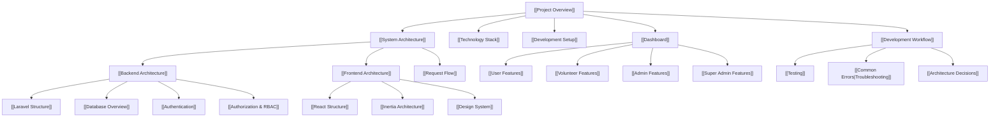

# 🐾 PAWLSE - Project Overview

> **PAWLSE** is an AI-assisted stray animal welfare management and engagement platform built for **Iligan Stray Feeders** (STI College Cagayan de Oro Capstone Project).

---

## 🎯 Purpose & Vision

Traditional stray animal welfare initiatives face coordination bottlenecks: fragmented reporting across social media, delayed emergency responses, manual spreadsheets for inventory and donations, and lack of transparency. 

**PAWLSE** centralizes animal rescue operations, AI-assisted breed/species identification, adoption processing, volunteer coordination, donation transparency, and comprehensive administrative governance into a single, unified web application.

---

## 🗺️ Vault Navigation & Knowledge Hub

Welcome to the **PAWLSE Obsidian Developer Vault**. Use the interactive links below to explore the documentation hierarchy:

### 📚 Core Sections
- **Overview & Stack**: [[Project Overview]] | [[Technology Stack]] | [[Development Setup]]
- **Architecture**: [[System Architecture]] | [[Backend Architecture]] | [[Frontend Architecture]] | [[Request Flow]]
- **Backend**: [[Laravel Structure]] | [[Routes]] | [[Controllers]] | [[Models]] | [[Middleware]] | [[Services]] | [[Validation]]
- **Frontend**: [[React Structure]] | [[Inertia Architecture]] | [[Pages]] | [[Components]] | [[Layouts]] | [[TypeScript]] | [[State Management]]
- **Database**: [[Database Overview]] | [[Schema]] | [[Tables]] | [[Relationships]] | [[Migrations]]
- **Features & Modules**: [[Authentication]] | [[Authorization & RBAC]] | [[Dashboard]] | [[User Features]] | [[Volunteer Features]] | [[Admin Features]] | [[Super Admin Features]]
- **UI & UX**: [[Design System]] | [[Colors & Themes]] | [[Typography]] | [[Components|UI Components]] | [[Responsive Design]]
- **APIs & Integrations**: [[API Overview]] | [[External APIs]] | [[Email & Notifications]]
- **Development & Ops**: [[Development Workflow]] | [[Git Workflow]] | [[Testing]] | [[Deployment]]
- **Troubleshooting & Support**: [[Common Errors]] | [[Laravel Errors]] | [[React Errors]] | [[Inertia Errors]] | [[Database Errors]]
- **Decisions**: [[Architecture Decisions]]

---

## 👥 Target Users & Personas

| Role | Target Audience | Primary Responsibilities / Capabilities |
|---|---|---|
| **Public / Guest** | Community members, pet lovers, donors | Browse adoptables, view feeding schedules, submit rescue/SOS alerts, report missing pets, make donations. |
| **Registered User** | Authenticated community members | Apply for adoption, apply for volunteer status, track personal rescue reports and donations, manage profile. |
| **Volunteer** | Approved shelter volunteers | Access volunteer dashboard, accept assigned rescue tasks, update mission statuses, view certificates and history. |
| **Admin** | Animal shelter managers / coordinators | Validate AI reports, approve/reject adoptions, manage volunteers, verify donations, track inventory, schedule events. |
| **Super Admin** | System administrators & executive leads | System-wide audit logs, user & role management, backup/restore, AI threshold configuration, module control, archive management. |

---

## 🌟 Key Functional Pillars

1. **AI-Assisted Rescue & SOS Dispatch**: Real-time image recognition via FastAPI backend to suggest breed, species, and age categories, auto-detecting geospatial duplicate reports within 500m / 24h.
2. **Transparent Donation Pipeline**: Support for Cash (GCash, Maya, Bank Transfer with receipt upload) and In-Kind donations with inventory tracking, batch expiry management, and public transparency audits.
3. **End-to-End Adoption Lifecycle**: Multi-step application submission, document uploads, automated status notifications, and animal availability locks.
4. **Role-Based Volunteer Coordination**: Application workflows, task dispatching with real-time status updates, feeding route assignments, and automated certificate generation.
5. **Robust Administrative & Audit Governance**: Action logging, login attempt tracking, automated database backups, soft-delete archiving, and configurable system settings.

---

## 📊 Current Project Status

- **Framework**: Laravel 13 with Inertia.js v3 + React 19 + TypeScript.
- **Frontend Architecture**: Tailwind CSS v4, Lucide Icons, Radix UI primitives, Motion (Framer Motion).
- **Authentication**: Laravel Fortify with 6-digit Email OTP Verification, Two-Factor Authentication (2FA), and Spatie Laravel-Permission RBAC.
- **Testing**: Pest PHP v4 suite with comprehensive feature tests for authentication, adoptions, donations, AI validations, volunteer tasks, and role gates.
- **Status**: **Active Development / Capstone Implementation Phase**.

---

## ⏭️ Next Steps & Roadmap

- [ ] Complete automated payment gateway webhook integrations (PayMongo/Xendit) (see [[External APIs]]).
- [ ] Connect production AI model service endpoint with fine-tuned dataset weights for Philippine stray breeds (Aspin / Puspin).
- [ ] Enhance live map dispatch with real-time geolocation tracking.
- [ ] Implement push notifications and automated SMS dispatch alerts.
