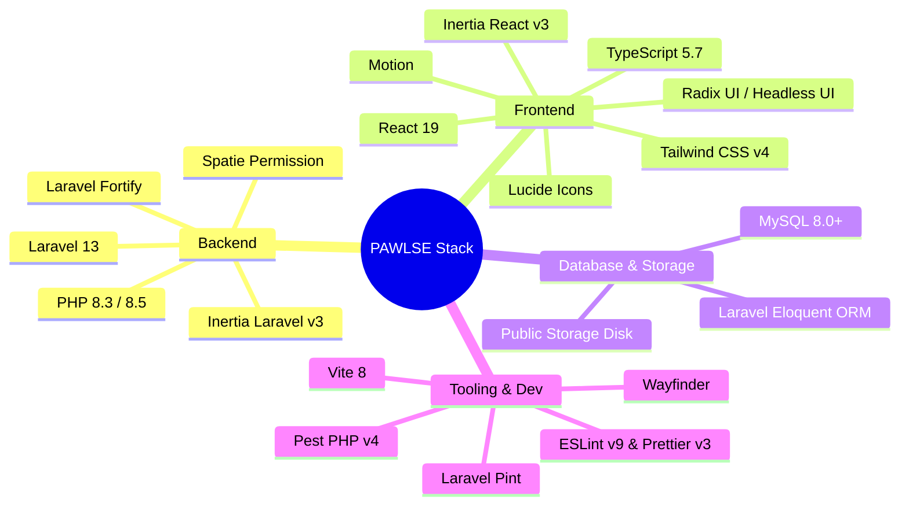

# 🛠️ Technology Stack

PAWLSE is built on a modern, unified full-stack architecture combining a robust Laravel backend with an SPA-feel React 19 frontend powered by Inertia.js v3.

---

## 🏗️ Core Technologies

---

## 📦 Package & Dependency Breakdown

### Backend (PHP / Composer)

| Package | Version | Purpose / Usage in PAWLSE |
|---|---|---|
| `php` | `^8.3` / `8.5` | Strict types, property promotion, match expressions, modern enums. |
| `laravel/framework` | `^13.7` | Core MVC framework, Eloquent ORM, routing, notifications, queues. |
| `inertiajs/inertia-laravel` | `^3.0` | Inertia server adapter connecting Laravel responses to React pages. |
| `laravel/fortify` | `^1.34` | Headless authentication backend (login, registration, 2FA, password resets). |
| `spatie/laravel-permission` | `^8.3` | Role-Based Access Control (`user`, `volunteer`, `admin`, `super-admin`). |
| `laravel/wayfinder` | `^0.1.14` | Generates TypeScript route functions directly from Laravel routes. |
| `laravel/socialite` | `^5.30` | OAuth authentication integration (Google, Facebook login). |
| `pestphp/pest` | `^4.6` | Elegant, modern testing framework for unit and feature tests. |
| `laravel/pint` | `^1.27` | Opinionated PHP code style fixer for strict PSR-12 / Laravel standards. |

### Frontend (Node / NPM)

| Package | Version | Purpose / Usage in PAWLSE |
|---|---|---|
| `react` & `react-dom` | `^19.2.0` | Declarative UI component library utilizing modern hooks and concurrency. |
| `@inertiajs/react` | `^3.0.0` | Client-side routing, form handling (`useForm`), instant visits, shared state. |
| `typescript` | `^5.7.2` | Full static type safety across pages, components, hooks, and API actions. |
| `tailwindcss` | `^4.0.0` | Modern CSS-first utility styling engine with custom `@theme` tokens. |
| `@radix-ui/react-*` | `^1.1.x` | Accessible, unstyled UI primitives (Dialog, Dropdown, Avatar, Tooltip, Select). |
| `@headlessui/react` | `^2.2.0` | Transition and accessibility components. |
| `lucide-react` | `^0.475.0` | Comprehensive, consistent icon system for UI navigation and status indicators. |
| `motion` | `^12.38.0` | Fluid animations, card reveals, page transitions, and interactive micro-animations. |
| `recharts` | `^3.8.1` | Data visualization for admin reports and super-admin analytics dashboards. |
| `sonner` | `^2.0.7` | Toast notification system with custom themes. |
| `vite` | `^8.0.0` | Next-generation frontend build tool and hot-module replacement (HMR) server. |

---

## 🌐 External & AI Services

- **AI Service Gateway**: Python/FastAPI microservice interfacing with PyTorch/TensorFlow models for image classification (animal breed, age category, gender, name suggestions) (see [[External APIs]]).
- **Payment Providers**: GCash, Maya, and Bank manual verification with proof-of-payment uploads and planned PayMongo/Xendit automation.
- **Mail & Notification Service**: SMTP mailer with custom queued notifications (Email OTP verification, adoption approvals, donation receipts).

---

## 🔗 Related Documentation
- [[Project Overview]]
- [[Development Setup]]
- [[System Architecture]]
- [[Frontend Architecture]]
- [[Backend Architecture]]
