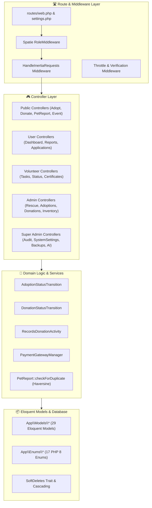

# ⚙️ Backend Architecture

The backend of **PAWLSE** is built with **Laravel 13** on **PHP 8.3/8.5**, adhering to strict object-oriented patterns, domain-driven organization, and strong typing.

---

## 🏛️ Architectural Overview

---

## 📂 Core Backend Components

### 1. Route Layer (`routes/`)
- `routes/web.php`: Primary application routing containing public routes, authenticated OTP verify routes, and role-scoped route groups (`/account/user/*`, `/account/volunteer/*`, `/account/admin/*`, `/account/super-admin/*`).
- `routes/settings.php`: User profile, password update, and appearance routes.
- `routes/console.php`: Scheduled commands (such as `pawlse:auto-backup`).

### 2. Middleware Pipeline (`app/Http/Middleware/`)
- `HandleInertiaRequests`: Injects global shared props (`auth.user`, `dashboardRole`, `dashboardNotifications`, `unreadNotificationCount`, `dashboardChrome`, `can_switch_to_volunteer`).
- `HandleAppearance`: Controls SSR and theme cookies.
- `Spatie\Permission\Middleware\RoleMiddleware`: Validates role permissions for each authenticated route prefix.

### 3. Controller Architecture (`app/Http/Controllers/`)
The controllers are organized modularly by domain and role:
- **Public**: `HomeController`, `AdoptController`, `DonateController`, `PetReportController`, `EventController`, `VolunteerController`.
- **Admin**: `Admin\RescueManagementController`, `Admin\AdoptionManagementController`, `Admin\DonationMonitoringController`, `Admin\VolunteerManagementController`, `Admin\EventManagementController`, `Admin\AiValidationController`, `Admin\ReportsAnalyticsController`, `Admin\DashboardController`.
- **Super Admin**: `SuperAdmin\DashboardController`, `SuperAdmin\UserManagementController`, `SuperAdmin\AuditLogController`, `SuperAdmin\ArchiveController`, `SuperAdmin\SecurityController`, `SuperAdmin\BackupController`, `SuperAdmin\AiConfigController`, `SuperAdmin\SystemSettingsController`, `SuperAdmin\AnalyticsController`.
- **Volunteer & User**: `VolunteerDashboardController`, `UserNotificationController`, `DashboardRedirectController`.

### 4. Domain & State Transitions
- **`Adoptions\AdoptionStatusTransition`**: Handles state transitions (`pending` → `under_review` → `home_visit_scheduled` → `approved` / `rejected` → `completed` / `cancelled`), ensures animal status updates (`available` → `pending_adoption` → `adopted`), and triggers notifications.
- **`Donations\DonationStatusTransition`**: Manages donation approval flows (`pending_verification` → `verified` / `rejected` / `resubmission_requested`), adjusts inventory balances for verified in-kind items, and dispatches receipts.
- **`Payments\PaymentGatewayManager`**: Coordinates payment methods (GCash, Maya, Bank Transfer) and reference generation (`DON-YYYYMMDD-XXXX`).

### 5. Models & Enums (`app/Models/`, `app/Enums/`)
- 29 Eloquent models with strong relationships, attribute casting, fillable definitions, and query scopes.
- 17 PHP 8 backed string enums guaranteeing data integrity across adoption status, animal age, audit actions, donation types, payment providers, and roles.

---

## 🔗 Related Documentation
- [[Laravel Structure]]
- [[Routes]]
- [[Controllers]]
- [[Models]]
- [[Middleware]]
- [[Services]]
- [[Validation]]
