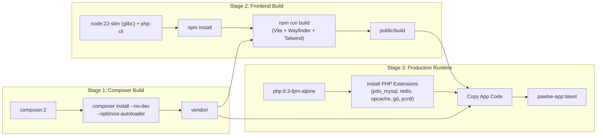
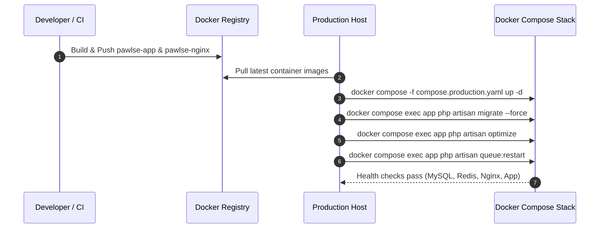

# 🐳 Container Architecture

This document describes the containerization architecture of **PAWLSE** using **Docker** and **Docker Compose**.

---

## 🎯 Rationale & Objectives

Containerizing PAWLSE provides:
1. **Environment Parity**: Eliminates "it works on my machine" discrepancies between local development, staging, and production environments.
2. **Immutable Artifacts**: Multi-stage Docker builds generate reproducible, production-ready images containing pre-compiled React 19/Vite assets and optimized Composer dependencies.
3. **Service Isolation & Security**: Database (MySQL), In-Memory Cache (Redis), and FastCGI backend (PHP-FPM) run within an isolated internal Docker network with zero exposed internal ports.
4. **Resilient Background Processing**: Dedicated, auto-restarting containers handle asynchronous queues and scheduled maintenance tasks independently from web traffic.

---

## 📐 Production Topology

```mermaid
flowchart TD
    subgraph Public ["🌍 Public Internet"]
        Client["Browser / Client"]
    end

    subgraph Ingress ["🚪 Web Ingress"]
        Nginx["Nginx Web Server\n(Port 80/443)"]
    end

    subgraph AppTier ["⚙️ Application Runtime (Internal Network)"]
        PHPFPM["PHP-FPM (Laravel 13)\n(Port 9000)"]
        QueueWorker["Queue Worker\n(php artisan queue:work)"]
        Scheduler["Scheduler Worker\n(php artisan schedule:work)"]
    end

    subgraph DataTier ["💾 Stateful Services & Storage"]
        MySQL[("MySQL 8.0\n(Internal Port 3306)")]
        Redis[("Redis 7.0\n(Internal Port 6379)")]
        StorageVolume[("Persistent Storage Volume\n/var/www/html/storage")]
        MySQLVolume[("MySQL Data Volume\n/var/lib/mysql")]
        RedisVolume[("Redis Data Volume\n/data")]
    end

    Client -->|HTTP/HTTPS| Nginx
    Nginx -->|FastCGI (TCP 9000)| PHPFPM
    Nginx -->|Static Assets & Uploads| StorageVolume
    PHPFPM -->|Queries| MySQL
    PHPFPM -->|Cache & Sessions| Redis
    PHPFPM -->|File Storage & Backups| StorageVolume
    QueueWorker -->|Jobs & Events| MySQL
    QueueWorker -->|Queue Driver| Redis
    QueueWorker -->|Files| StorageVolume
    Scheduler -->|Triggers| PHPFPM
    MySQL --- MySQLVolume
    Redis --- RedisVolume
```

---

## 🏢 Services Overview

| Service | Image / Base | Responsibility | Ports Exposed | Persistent Volume |
| :--- | :--- | :--- | :--- | :--- |
| **`nginx`** | `pawlse-nginx:latest` (Alpine) | Web server, static Vite asset serving, SSL/TLS termination, FastCGI proxy | `80` (or `FORWARD_HTTP_PORT`) | `app_storage` (Read-Only) |
| **`app`** | `pawlse-app:latest` (`php:8.3-fpm-alpine`) | Laravel 13 HTTP application engine, PHP-FPM | Internal only (`9000`) | `app_storage` (Read-Write) |
| **`mysql`** | `mysql:8.0` | Primary relational database | Internal only (`3306`) | `mysql_data` |
| **`redis`** | `redis:7-alpine` | High-performance cache, session store, and queue broker | Internal only (`6379`) | `redis_data` |
| **`queue`** | `pawlse-app:latest` | Background job processing (`php artisan queue:work`) | None | `app_storage` (Read-Write) |
| **`scheduler`** | `pawlse-app:latest` | Scheduled task execution (`php artisan schedule:work`) | None | `app_storage` (Read-Write) |

---

## 🏗️ Multi-Stage Docker Image Build Flow

The application image uses a multi-stage Docker build pipeline:



### Required PHP Extensions
- **Database**: `pdo_mysql`, `pdo_sqlite` (for testing/backups).
- **Core Performance**: `opcache`, `bcmath`, `intl`, `mbstring`.
- **Media & Files**: `gd`, `exif`, `zip` (for pet images, report photos, certificates, QR codes).
- **Process & Async**: `pcntl` (for graceful queue worker shutdown), `redis` (for phpredis cache/queue).

---

## 🔒 Security Architecture

1. **Zero Public Exposure for Internal Services**:
   - `mysql` (3306), `redis` (6379), and `app` (9000) have **no exposed host ports** in production.
   - Only `nginx` (80/443) communicates across the container boundary.
2. **Secrets & Environment Isolation**:
   - No `.env` files or API secrets are embedded inside Docker images.
   - Configuration is passed via environment variables or Docker secrets at runtime.
   - `.dockerignore` blocks `.env`, local SQLite files, and developer caches.
3. **Process Hardening**:
   - PHP-FPM executes under the non-privileged `www-data` system account.
   - Sensitive hidden directories (`.git`, `.env`, `.obsidian`) are blocked at the Nginx layer with a `403 Forbidden` response.
4. **Production PHP Hardening**:
   - `expose_php = Off` hides PHP runtime versions from response headers.
   - `display_errors = Off` prevents stack trace leaks to end users.
   - `opcache.validate_timestamps = 0` provides optimal performance and protects against runtime code tampering.

---

## 💾 Storage & Data Persistence

PAWLSE manages multiple persistent storage points:
1. **User Uploads & Documents**: Stored under `storage/app/public/` (pet photos, adoption forms, donation receipts, avatars) and mapped to the `app_storage` named volume.
2. **Database State**: Stored in `mysql_data` volume at `/var/lib/mysql`.
3. **Redis Persistence**: AOF (Append-Only File) logging enabled on `redis_data` volume at `/data`.

> [!WARNING]
> **Docker Volume ≠ Backup Strategy**
> A persistent Docker volume protects against container recreation, but does **not** protect against disk failure, catastrophic host loss, or accidental truncation.
> Production deployments must utilize automated database dumps (via `app:auto-backup` or an external backup cron) backed up offsite to S3/Cloud Storage.

---

## 🔄 Deployment Lifecycle



---

## 🔗 Related Documentation
- [[Docker Development]]
- [[System Architecture]]
- [[Backend Architecture]]
- [[Frontend Architecture]]
- [[Database Overview]]
- [[Deployment]]
