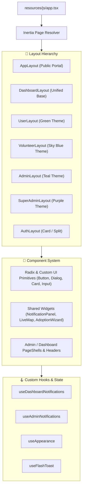

# 🖥️ Frontend Architecture

The frontend of **PAWLSE** is built using **React 19** with **TypeScript**, **Inertia.js v3**, and **Tailwind CSS v4**.

---

## 🎨 Architectural Hierarchy



---

## 📂 Frontend Directory Structure

```
resources/js/
├── actions/             # Wayfinder auto-generated TypeScript controller route helpers
├── components/          # Reusable component library
│   ├── admin/           # Admin-specific shells, charts, sidebars, headers
│   ├── dashboard/       # User & Volunteer dashboard headers, sidebars, theme toggles
│   ├── ui/              # Radix primitives (Button, Card, Dialog, Select, Sonner, etc.)
│   └── *.tsx            # Domain components (LiveMap, AdoptionWizard, MerchStore, etc.)
├── hooks/               # Custom React hooks (notifications, appearance, clipboard, toast)
├── layouts/             # Specialized shell layouts for each role & portal
│   ├── app-layout.tsx           # Public site layout (navbar, footer, hero styling)
│   ├── dashboard-layout.tsx     # Base dashboard container with dynamic theming
│   ├── user-layout.tsx          # User dashboard layout
│   ├── volunteer-layout.tsx     # Volunteer dashboard layout
│   ├── admin-layout.tsx         # Admin dashboard layout
│   ├── super-admin-layout.tsx   # Super Admin dashboard layout
│   └── auth-layout.tsx          # Authentication pages layout
├── pages/               # Inertia page views
│   ├── admin/           # Admin management pages
│   ├── auth/            # Fortify auth pages (Login, Register, OTP, 2FA, Reset)
│   ├── settings/        # Account & Appearance settings
│   ├── super-admin/     # Super Admin governance pages
│   ├── user/            # Public user dashboard pages
│   ├── volunteer/       # Volunteer operation pages
│   └── *.tsx            # Public pages (home, about, adopt, donate, rescue, sos, events)
└── types/               # TypeScript interfaces & types
    ├── admin.ts         # Admin domain interfaces
    ├── auth.ts          # User, Auth, Fortify types
    ├── dashboard.ts     # Metric cards, status badges, activity logs
    ├── navigation.ts    # NavItem and sidebar link interfaces
    └── ui.ts            # Component prop types
```

---

## 🔄 The Inertia.js Bridge

Unlike traditional SPAs that communicate via REST or GraphQL with custom state synchronization, PAWLSE uses **Inertia.js v3**:
1. **Server-Driven Data**: Pages receive data directly as React props returned from Laravel controllers (`Inertia::render('admin/dashboard', $data)`).
2. **Form Submissions**: Forms utilize the `@inertiajs/react` `useForm` hook for seamless client-side submissions, automatic validation error handling, and CSRF token management.
3. **Optimistic Updates & Instant Visits**: Smooth navigation between dashboard tabs without full browser reloads.
4. **Shared Props**: Global session data (`auth.user`, notification counts, theme state) is shared via `HandleInertiaRequests` middleware and accessed with `usePage().props`.

---

## 🎨 Theme & Styling System

The application uses **Tailwind CSS v4** with a role-driven CSS variable theme engine:
- **Public**: Warm Orange (`#F59E0B`) with playful typography (`Fredoka` for headings, `Quicksand` for body).
- **User Dashboard**: Forest Green (`#16a34a`)
- **Volunteer Dashboard**: Ocean Blue (`#00b4d8`)
- **Admin Dashboard**: Deep Teal (`#0d9488`)
- **Super Admin Dashboard**: Royal Purple (`#7c3aed`)

---

## 🔗 Related Documentation
- [[React Structure]]
- [[Inertia Architecture]]
- [[Pages]]
- [[Components]]
- [[Layouts]]
- [[Design System]]
