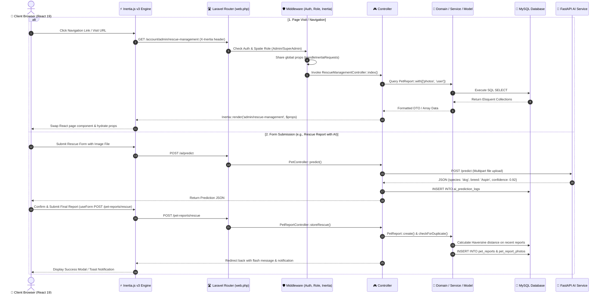

# 🔁 Request Flow

This document outlines how HTTP requests, Inertia visits, form submissions, and background notifications flow through the **PAWLSE** full-stack pipeline.

---

## 🌊 Complete End-to-End Request Flow

---

## 🔍 Step-by-Step Flow Breakdown

### 1. Inbound Request Handling
- **Request Ingress**: The browser dispatches an HTTP request.
- **Inertia Detection**: If the request includes the `X-Inertia: true` header, Laravel knows to return a lightweight JSON payload containing the component name and updated props rather than a full HTML document.
- **Routing**: `routes/web.php` maps the URI and HTTP verb to the appropriate controller method.

### 2. Middleware Pipeline
Requests pass through a sequential middleware chain:
1. `Illuminate\Session\Middleware\StartSession`: Initializes session storage.
2. `Illuminate\Auth\Middleware\Authenticate` (`auth`): Ensures the user is logged in.
3. `Illuminate\Auth\Middleware\EnsureEmailIsVerified` (`verified`): Verifies OTP completion.
4. `Spatie\Permission\Middleware\RoleMiddleware`: Validates that the authenticated user possesses the required role (`User`, `Volunteer`, `Admin`, or `SuperAdmin`).
5. `App\Http\Middleware\HandleInertiaRequests`: Resolves shared props (`auth.user`, unread notifications count, theme colors, sidebar state).

### 3. Controller & Business Logic
- **Controller**: Extracts validated request data using Form Requests (e.g., `StoreAdoptionApplicationRequest`, `StoreCashDonationRequest`).
- **Domain Operations**: Invokes domain transition classes (such as `AdoptionStatusTransition` or `DonationStatusTransition`) to ensure valid lifecycle updates.
- **Model Interactions**: Eloquent models execute database queries with relationships, soft deletes, and timestamp tracking.

### 4. Response & Client Hydration
- The controller returns an `Inertia::render('page/name', $props)` response.
- On client receipt, Inertia dynamically mounts the target React component from `resources/js/pages/` and passes the fresh server props without losing client-side state.

---

## 🔗 Related Documentation
- [[System Architecture]]
- [[Backend Architecture]]
- [[Frontend Architecture]]
- [[Controllers]]
- [[Middleware]]
