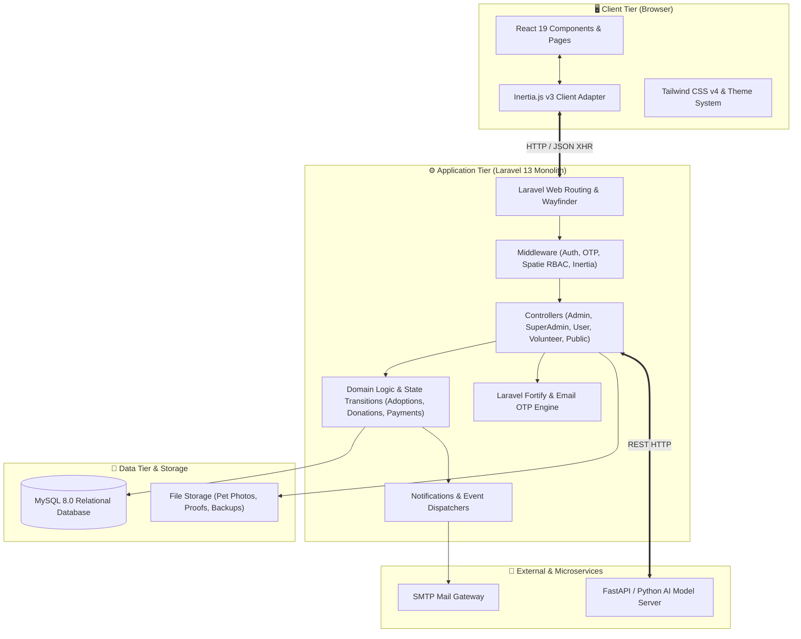

# 🏛️ System Architecture

PAWLSE is designed as a **modern monolithic full-stack application** that leverages a **Three-Tier Architecture** coupled with an **Inertia.js Single-Page Application (SPA)** bridge.

---

## 📐 High-Level Architecture Diagram

---

## 🏢 Architectural Tiers

### 1. Presentation Tier (Frontend SPA)
- Built with **React 19** and **TypeScript**.
- Client-side navigation handled seamlessly without full browser page reloads via **Inertia.js v3**.
- Styled using **Tailwind CSS v4** with granular color tokens, dark/light mode toggle, and role-specific dashboard chrome themes (`user`, `volunteer`, `admin`, `super-admin`).
- Reusable UI component library based on **Radix UI primitives** and customized components in `resources/js/components/ui/`.

### 2. Application & Business Tier (Laravel 13 Monolith)
- **Routing**: Centralized web routes with Wayfinder generating type-safe TypeScript action helpers (`@/actions/App/Http/Controllers/...`).
- **Authentication & Security**: Handled natively by Laravel Fortify with custom 6-digit Email Verification OTP and Two-Factor Authentication (2FA).
- **Authorization**: Integrated with **Spatie Laravel-Permission** and enum-backed roles (`App\Enums\Role`).
- **Domain Business Logic**:
  - Explicit state transitions for Adoptions (`AdoptionStatusTransition`) and Donations (`DonationStatusTransition`).
  - Automated geospatial duplicate detection for animal rescue reports (Haversine formula within 500m radius).
  - Inventory batch management with automatic status depreciation (good, low, critical, depleted).

### 3. Data Tier (Relational & File Storage)
- **Relational Database**: **MySQL** managing 30+ tables with strict foreign key constraints, indexes, cascade deletions, and soft-delete capabilities.
- **File System**: Laravel storage disks managing public uploads (`pet-reports`, `adoption-documents`, `donation-proofs`, `avatars`) and private storage (`backups`).

---

## 🔗 Related Documentation
- [[Backend Architecture]]
- [[Frontend Architecture]]
- [[Request Flow]]
- [[Database Overview]]
- [[Authorization & RBAC]]
