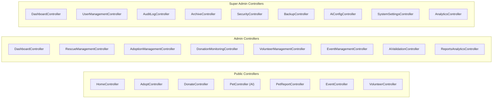

# 🎮 Controllers

Controllers in PAWLSE act as traffic directors between incoming HTTP requests, domain logic, and Inertia.js views.

---

## 📂 Controller Map by Domain

---

## 🔍 Key Controllers & Responsibilities

### 1. Public & Core Controllers

- **`HomeController`**: Aggregates platform-wide landing stats (rescued pets, completed adoptions, active volunteers, total donations) and recent success stories for the public homepage.
- **`AdoptController`**: Fetches adoptable animals (`ShelterAnimal`) with age, gender, type filters, and eager-loaded donation needs.
- **`DonateController`**: Manages the multi-type donation pipeline (cash, in-kind supplies, pet sponsorship) and checkout routing with payment reference generation (`DON-YYYYMMDD-XXXX`).
- **`PetController`**: Interfaces with the external Python/FastAPI AI server to upload images for real-time breed/species identification and generates pet name recommendations.
- **`PetReportController`**: Handles public submission of rescue reports, missing pets, and emergency SOS alerts with auto-duplicate detection.

### 2. Admin Controllers (`app/Http/Controllers/Admin/`)

- **`RescueManagementController`**: Lists incoming rescue reports, handles volunteer task assignment, status updates (`pending`, `assigned`, `in_progress`, `rescued`, `cancelled`), and duplicate resolution.
- **`AiValidationController`**: Dedicated panel for animal shelter staff to approve or reject AI-predicted animal profiles before they enter adoption pipelines.
- **`AdoptionManagementController`**: Reviews adoption applications, manages status transitions (`under_review`, `home_visit_scheduled`, `approved`, `rejected`, `completed`), and manages shelter animal profiles with urgent needs.
- **`DonationMonitoringController`**: Verifies manual cash receipts (GCash/Maya/Bank), inspects in-kind item donations, and tracks medical/food inventory batches and stock adjustments.
- **`VolunteerManagementController`**: Approves/rejects volunteer applications, assigns field rescue tasks, and issues digital certificates of appreciation.
- **`EventManagementController`**: Organizes community outreach campaigns and feeding route schedules.
- **`ReportsAnalyticsController`**: Generates monthly adoption, donation, and rescue metrics with CSV export.

### 3. Super Admin Controllers (`app/Http/Controllers/SuperAdmin/`)

- **`UserManagementController`**: Full CRUD on user accounts, role assignments (`user`, `volunteer`, `admin`, `super-admin`), password resets, and account restorations.
- **`AuditLogController`**: Searchable and filterable activity log viewer capturing actions (`create`, `update`, `delete`, `restore`, `login`) across all system entities.
- **`ArchiveController`**: Unified soft-delete trash bin enabling restoration or permanent hard-deletion of archived records across 7 core modules.
- **`BackupController`**: Triggers manual or automated MySQL database backups (`pawlse:auto-backup`), handles single-click restores, and manages backup retention schedules.
- **`AiConfigController`**: Configures AI model confidence thresholds (default: `0.70`), toggles feature switches (`ai_reporting_enabled`, `ai_identifying_enabled`), and inspects prediction logs.
- **`SystemSettingsController`**: Updates platform metadata, emergency contacts, shelter operational hours, and maintenance modes.
- **`AnalyticsController`**: Executive-level data visualizations and cross-module performance metrics.

---

## 🔗 Related Documentation
- [[Routes]]
- [[Models]]
- [[Services]]
- [[Validation]]
- [[Inertia Architecture]]
