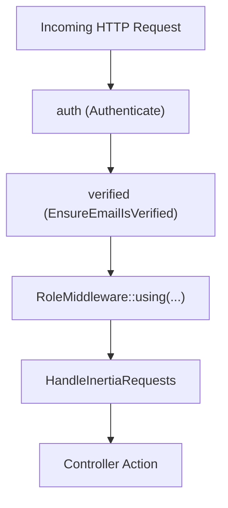

# 🛡️ Middleware

Middleware in PAWLSE manages request filtering, session hydration, role authorization, and global Inertia property sharing.

---

## 📋 Middleware Registry



---

## 🔍 Detailed Middleware Breakdown

### 1. `HandleInertiaRequests` (`app/Http/Middleware/HandleInertiaRequests.php`)
The primary data pipeline connecting Laravel's backend context with the React frontend. It shares the following properties on every Inertia response:

- **`name`**: Application name (`PAWLSE`).
- **`auth.user`**: The authenticated `User` model instance (or `null`), with appended virtual attributes such as `avatar`.
- **`can_switch_to_volunteer`**: Boolean flag indicating if the authenticated user has an approved volunteer record.
- **`sidebarOpen`**: Boolean read from the `sidebar_state` cookie for layout persistence.
- **`dashboardRole`**: Detects current route prefix (`'user'`, `'volunteer'`, `'admin'`, `'super-admin'`).
- **`dashboardNotifications`**: Latest 30 database notifications mapped to a standardized notification DTO.
- **`unreadNotificationCount`**: Number of unread database notifications for the current user.
- **`dashboardChrome`**: Dynamic greeting (`'Good Morning'`, `'Good Afternoon'`, `'Good Evening'`) and localized date string.

### 2. `Spatie\Permission\Middleware\RoleMiddleware`
Guards role-restricted endpoints by inspecting Spatie permissions:
```php
$userDashboardMiddleware = ['auth', 'verified', RoleMiddleware::using(Role::User)];
$volunteerDashboardMiddleware = ['auth', 'verified', RoleMiddleware::using(Role::Volunteer)];
$adminDashboardMiddleware = ['auth', 'verified', RoleMiddleware::using([Role::Admin, Role::SuperAdmin])];
$superAdminDashboardMiddleware = ['auth', 'verified', RoleMiddleware::using(Role::SuperAdmin)];
```

### 3. `HandleAppearance` (`app/Http/Middleware/HandleAppearance.php`)
Reads the `appearance` cookie (`'light'`, `'dark'`, `'system'`) to set server-side layout attributes, preventing UI theme flicker upon initial page render.

### 4. Throttling & Rate Limiting (`AppServiceProvider`)
- **`throttle:email-verification-otp`**: Limits OTP code verification attempts to 5 attempts per window.
- **`throttle:email-verification-otp-resend`**: Enforces a 60-second cooldown between OTP resend requests.
- **`throttle:6,1`**: Password update throttling.

---

## 🔗 Related Documentation
- [[Laravel Structure]]
- [[Routes]]
- [[Authorization & RBAC]]
- [[Inertia Architecture]]
