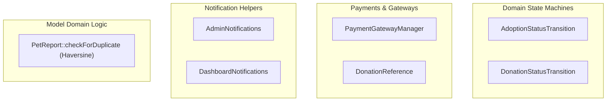

# ⚙️ Services & Domain Logic

While PAWLSE relies on lean controllers, core domain workflows are encapsulated within dedicated transition classes, payment managers, and helper services.

---

## 🧩 Key Domain Logic Units

---

## 🔍 Domain Units In Detail

### 1. `AdoptionStatusTransition` (`app/Adoptions/AdoptionStatusTransition.php`)
Governs the finite state machine for adoption applications:
- Validates allowed status transitions:
  - `pending` ➔ `under_review` ➔ `home_visit_scheduled` ➔ `approved` ➔ `completed`
  - Rejection / Cancellation pathways.
- Automatically locks or releases the associated `ShelterAnimal` status:
  - When approved: animal status moves to `pending_adoption`.
  - When completed: animal status moves to `adopted`.
  - When rejected/cancelled: animal status reverts to `available`.
- Dispatches `AdoptionApplicationStatusUpdatedNotification` to the applicant.

### 2. `DonationStatusTransition` (`app/Donations/DonationStatusTransition.php`)
Manages cash and in-kind donation verification:
- State transitions: `pending_verification` ➔ `verified`, `rejected`, `resubmission_requested`.
- Automatically logs entries in `donation_status_histories` and `donation_audit_logs`.
- When an in-kind donation is verified, it updates current inventory stock and creates an `InventoryLog` entry.
- Dispatches transactional notifications (`DonationVerifiedNotification`, `DonationRejectedNotification`).

### 3. `PaymentGatewayManager` (`app/Payments/PaymentGatewayManager.php`)
- Coordinates payment channels (`gcash`, `maya`, `bank_transfer`).
- Formats provider account names, account numbers, and QR code asset paths.
- Generates idempotent payment references via `DonationReference::generate()`.

### 4. `PetReport::checkForDuplicate()`
- Automated geospatial duplicate detection implemented directly in the model lifecycle (`creating` hook).
- Queries recent active reports (past 24 hours, matching species).
- Uses the **Haversine formula** to calculate distance between geographic coordinates. If within **500 meters (0.5 km)** or matching location text, the report is automatically marked as `is_duplicate = true` and `status = 'duplicate'` with a pointer to `duplicate_of_id`.

---

## 🔗 Related Documentation
- [[Laravel Structure]]
- [[Controllers]]
- [[Models]]
- [[Adoption Management|Admin Features]]
- [[Donation Monitoring|Admin Features]]
