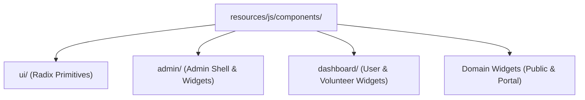

# 🧩 Components

PAWLSE features a component library comprising accessible **Radix UI primitives**, shared domain widgets, and role-specific dashboard shells.

---

## 📂 Component Categories

---

## 🔍 Key Component Libraries

### 1. Radix UI Primitives (`components/ui/`)
Built with accessibility (WAI-ARIA) compliance:
- **`button.tsx`**: Button with variants (`default`, `destructive`, `outline`, `secondary`, `ghost`, `link`) and animated loading states.
- **`card.tsx`**: Card, CardHeader, CardTitle, CardDescription, CardContent, CardFooter.
- **`dialog.tsx`**: Accessible modal dialogs with backdrop blur and keyboard dismissal.
- **`select.tsx`**: Custom styled dropdown selection with keyboard navigation.
- **`sonner.tsx`**: Floating toast notification provider.
- **`input.tsx` & `input-otp.tsx`**: Form text input and 6-slot OTP digit input.
- **`avatar.tsx` & `badge.tsx`**: User avatars with fallbacks and status indicator tags.
- **`sidebar.tsx`**: Responsive collapsible sidebar container.

### 2. Admin Shell & Widgets (`components/admin/`)
- **`page-shell.tsx`**: Standardized admin page wrapper with title, actions, and search bar.
- **`header.tsx`**: Admin header with live clock, theme switcher, and notification bell.
- **`sidebar.tsx`**: Collapsible role-based navigation sidebar with active link highlights.
- **`bar-chart.tsx`**: Responsive Recharts wrapper for analytics and inventory levels.
- **`notification-panel.tsx`**: Slide-out tray for real-time alerts and bulk mark-as-read actions.

### 3. Dashboard Components (`components/dashboard/`)
- **`header.tsx` & `sidebar.tsx`**: Dynamic user and volunteer navigation.
- **`notification-dropdown.tsx`**: Dropdown for unread notifications.
- **`shared-account-settings.tsx`**: Reusable profile editing and password change tabs.
- **`theme-toggle.tsx`**: Toggle between light, dark, and system color schemes.

### 4. Domain & Interactive Widgets (`components/`)
- **`adoption-wizard.tsx`**: Multi-step modal for submitting pet adoption applications with document uploads.
- **`report-rescue.tsx`**: Integrated rescue reporting form with live camera capture and AI preview.
- **`ai-feature.tsx`**: Visual card displaying AI confidence score and suggested tags.
- **`live-map.tsx`**: Interactive geospatial map displaying rescue locations and shelter hubs.
- **`horizontal-adoption-gallery.tsx`**: Smooth carousel showcasing featured adoptable pets.
- **`transparency-audit-modal.tsx`**: Public financial and in-kind donation audit viewer.
- **`submission-receipt.tsx`**: Digital receipt generator with printable QR code.

---

## 🔗 Related Documentation
- [[React Structure]]
- [[Layouts]]
- [[Design System]]
- [[Pages]]
