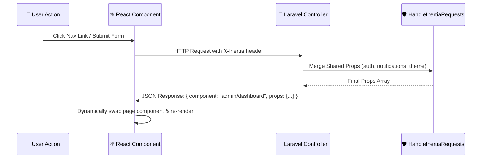

# ⚡ Inertia Architecture

Inertia.js v3 serves as the bridge between Laravel 13 on the backend and React 19 on the frontend, eliminating the need for client-side routing libraries or redundant API serialization layers.

---

## 🔄 How Inertia Operates in PAWLSE



---

## 🔑 Key Inertia Features Utilized

### 1. Dynamic Page Resolution (`resources/js/app.tsx`)
Inertia dynamically resolves page components from `resources/js/pages/` using Vite's `import.meta.glob`:
```typescript
createInertiaApp({
    title: (title) => title ? `${title} - ${appName}` : appName,
    resolve: (name) =>
        resolvePageComponent(
            `./pages/${name}.tsx`,
            import.meta.glob('./pages/**/*.tsx'),
        ),
    setup({ el, App, props }) {
        const root = createRoot(el);
        root.render(<App {...props} />);
    },
});
```

### 2. Form Handling with `useForm`
Inertia's `useForm` hook handles client-side form state, automated processing spinners, validation errors, and redirects:
```tsx
const { data, setData, post, processing, errors, reset } = useForm({
    amount: 500,
    payment_method: 'gcash',
    is_anonymous: false,
});

const handleSubmit = (e: React.FormEvent) => {
    e.preventDefault();
    post(route('donate.store-cash'));
};
```

### 3. Global Shared Props (`usePage`)
Shared props defined in `HandleInertiaRequests` are accessible on any React page:
```tsx
import { usePage } from '@inertiajs/react';
import type { SharedData } from '@/types';

export function UserNav() {
    const { auth, dashboardNotifications, unreadNotificationCount } = usePage<SharedData>().props;
    // ...
}
```

### 4. Link Pre-fetching & Instant Visits
Navigation uses the `<Link>` component for instant, seamless page transitions without full browser refreshes.

---

## 🔗 Related Documentation
- [[React Structure]]
- [[Pages]]
- [[Layouts]]
- [[State Management]]
- [[HandleInertiaRequests|Middleware]]
