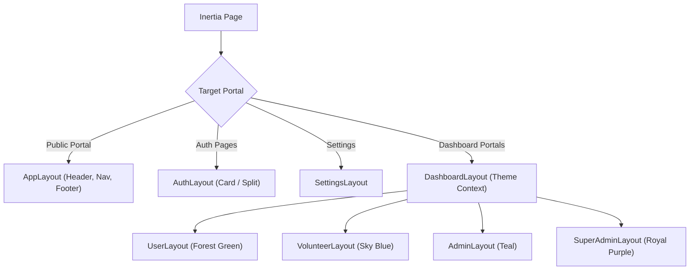

# 📐 Layouts

PAWLSE provides modular layout wrappers in `resources/js/layouts/` tailored for public visitors and authenticated roles.

---

## 🗺️ Layout Overview

---

## 🔍 Layouts In Detail

### 1. `AppLayout` (`resources/js/layouts/app-layout.tsx`)
- **Use Case**: Public pages (`/`, `/about`, `/adopt`, `/donate`, `/events`, `/rescue`, `/sos`, `/missing`).
- **Features**: Global navigation bar, mobile menu drawer, emergency SOS button, active page highlights, and comprehensive footer with quick links and shelter social handles.

### 2. `DashboardLayout` (`resources/js/layouts/dashboard-layout.tsx`)
- **Use Case**: Base shell for all authenticated dashboards.
- **Features**: Injects the `[data-dashboard-theme]` attribute onto the DOM, standardizes sidebar collapse states via cookies, and provides toast notifications through Sonner.

### 3. Role-Specific Dashboards
- **`UserLayout` (`user-layout.tsx`)**: Green-themed shell (`#16a34a`) featuring navigation to Bookmarks, Rescue Reports, Adoption Applications, Donations, Missing Reports, and Volunteer Status.
- **`VolunteerLayout` (`volunteer-layout.tsx`)**: Blue-themed shell (`#00b4d8`) featuring Assigned Tasks, Participation History, Certificates, and Field Rescue Case updates.
- **`AdminLayout` (`admin-layout.tsx`)**: Teal-themed shell (`#0d9488`) providing the operational command center: Rescue Management, AI Validation, Adoption Approvals, Volunteer Dispatch, Donation Monitoring, Events, and Reports.
- **`SuperAdminLayout` (`super-admin-layout.tsx`)**: Purple-themed shell (`#7c3aed`) featuring User Directory, Audit Logs, Soft Delete Archives, Security & Login Attempts, Database Backups, AI Settings, and System Settings.

### 4. `AuthLayout` (`resources/js/layouts/auth-layout.tsx`)
- **Use Case**: Login, Register, Forgot Password, Reset Password, 2FA Challenge, and Email OTP Verification.
- **Variants**: Simple card layout (`auth-simple-layout.tsx`), centered card (`auth-card-layout.tsx`), and split hero layout (`auth-split-layout.tsx`).

---

## 🔗 Related Documentation
- [[React Structure]]
- [[Pages]]
- [[Components]]
- [[Design System]]
- [[Colors & Themes]]
