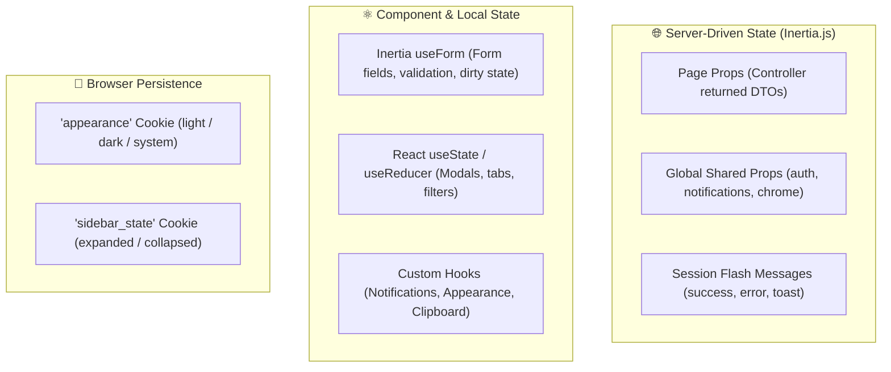

# 🧠 State Management

PAWLSE adopts a **server-first, lightweight client-side state strategy** leveraging Inertia.js v3, React hooks, and localStorage / cookies.

---

## 🏗️ State Distribution Strategy



---

## 🔍 State Management Layers

### 1. Page & Server Data (Inertia Props)
- Data is owned by the backend database and passed directly via Inertia page responses.
- Eliminates the need for client-side Redux/Zustand stores for caching relational entities.
- When an action is performed (e.g. approving an adoption), Laravel redirects back or to a new route, and Inertia automatically updates the relevant page props.

### 2. Form State (`useForm`)
- The `@inertiajs/react` `useForm` hook encapsulates form inputs, touched state, validation error bags, and submission status:
```tsx
const { data, setData, post, processing, errors, isDirty } = useForm({
    title: '',
    description: '',
});
```

### 3. Shared Global Notifications (`useDashboardNotifications`)
- Unread notifications and counts are passed in `HandleInertiaRequests` shared data.
- The `useDashboardNotifications` hook provides optimistic local marking-as-read and deletion actions while dispatching background PATCH/DELETE requests to `/account/notifications/*`.

### 4. Theme & Appearance (`useAppearance`)
- Manages switching between `light`, `dark`, and `system` modes.
- Synchronizes with a client cookie read by `HandleAppearance` middleware to prevent theme flickering on page refresh.

---

## 🔗 Related Documentation
- [[Inertia Architecture]]
- [[React Structure]]
- [[Components]]
- [[Design System]]
