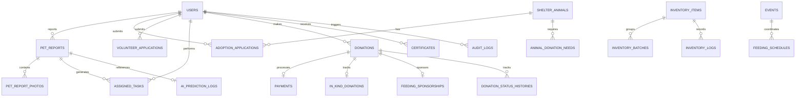

# 🗄️ Database Overview

PAWLSE uses **MySQL 8.0+** as its primary relational database management system, configured for ACID compliance, referential integrity, and performant indexing.

---

## 🏛️ Database Architecture

---

## 🔑 Key Database Characteristics

1. **Strict Foreign Keys & Cascade Integrity**: Foreign key constraints protect relational integrity across applications, payments, assigned tasks, and logs.
2. **Soft Deletion Architecture**: Core tables (`users`, `shelter_animals`, `pet_reports`, `adoption_applications`, `donations`, `events`, `inventory_items`) implement Laravel `SoftDeletes` (`deleted_at` timestamp). This supports safe archiving, restoration, and permanent deletion by Super Admins.
3. **Audit Logging & Immutability**: Critical security logs (`audit_logs`, `login_attempts`, `ai_prediction_logs`, `donation_status_histories`) maintain immutable transaction histories.
4. **Geospatial & Index Optimizations**: Spatial coordinate lookup and composite indexes on `(animal_type, status, created_at)` enable fast Haversine distance duplicate checking.

---

## 🔗 Related Documentation
- [[Schema]]
- [[Tables]]
- [[Relationships]]
- [[Migrations]]
- [[Super Admin Features|Archives & Backups]]
