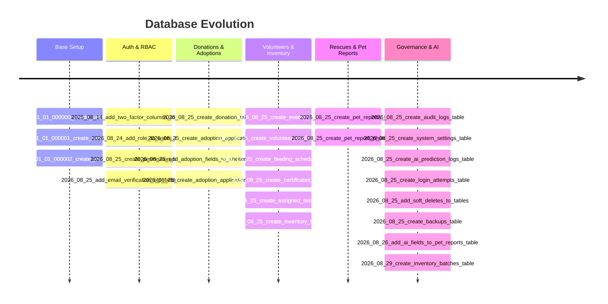

# 📜 Migrations

The database structure in PAWLSE is version-controlled via 31 sequential Laravel migration files located in `database/migrations/`.

---

## 📋 Migration Execution Timeline

---

## 🛠️ Common Migration Commands

| Command | Description |
|---|---|
| `php artisan migrate` | Run outstanding database migrations |
| `php artisan migrate:status` | Check the execution status of all migrations |
| `php artisan migrate:fresh --seed` | Wipe database, rerun all migrations, and seed sample records |
| `php artisan migrate:rollback` | Roll back the last migration batch |

---

## 🔗 Related Documentation
- [[Database Overview]]
- [[Schema]]
- [[Tables]]
- [[Development Setup]]
