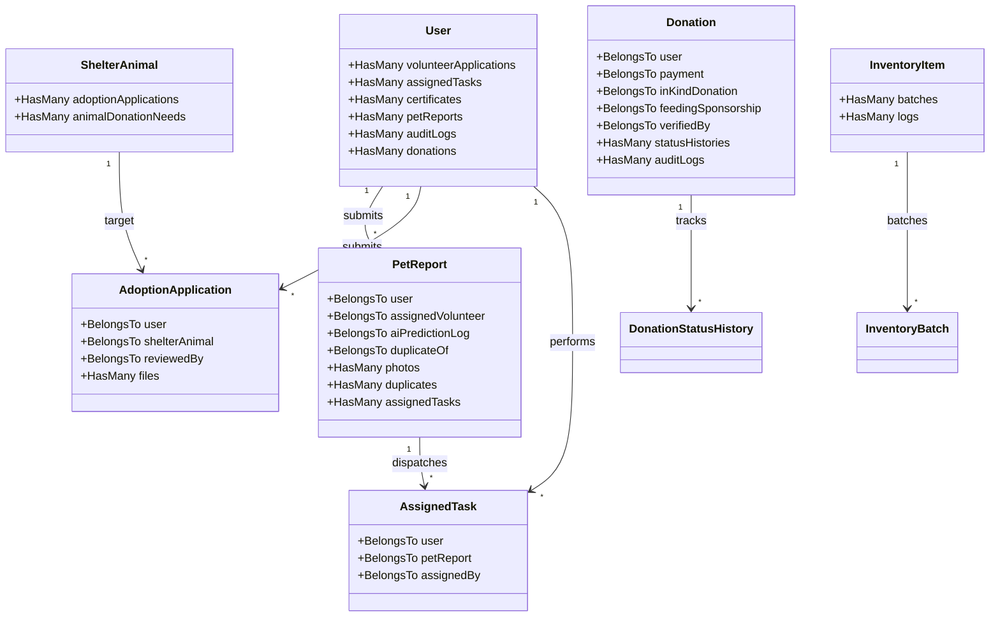

# 🔗 Database Relationships

This document outlines the Eloquent relationships connecting models across PAWLSE.

---

## 🗺️ Entity Relationship Map

---

## 🔍 Key Eloquent Relationship Specifications

### 1. `User` Model
- `volunteerApplications()`: `HasMany<VolunteerApplication>`
- `assignedTasks()`: `HasMany<AssignedTask>` (Volunteer duties)
- `certificates()`: `HasMany<Certificate>` (Certificates awarded)
- `petReports()`: `HasMany<PetReport>` (Submitted rescue reports)
- `auditLogs()`: `HasMany<AuditLog>` (User-triggered system events)

### 2. `PetReport` Model
- `user()`: `BelongsTo<User>` (Reporter, nullable for guest reports)
- `assignedVolunteer()`: `BelongsTo<User>` (Assigned rescuer)
- `aiPredictionLog()`: `BelongsTo<AiPredictionLog>` (Associated AI scan)
- `photos()`: `HasMany<PetReportPhoto>` (Incident photos)
- `duplicateOf()`: `BelongsTo<PetReport>` (Master report if duplicate)
- `duplicates()`: `HasMany<PetReport>` (Subordinate duplicate reports)
- `assignedTasks()`: `HasMany<AssignedTask>` (Tasks created to resolve this rescue)

### 3. `ShelterAnimal` Model
- `adoptionApplications()`: `HasMany<AdoptionApplication>` (Incoming applicant pool)
- `animalDonationNeeds()`: `HasMany<AnimalDonationNeed>` (Supply/fundraising goals)

### 4. `AdoptionApplication` Model
- `user()`: `BelongsTo<User>` (Adopter)
- `shelterAnimal()`: `BelongsTo<ShelterAnimal>` (Adopted pet)
- `reviewedBy()`: `BelongsTo<User>` (Admin reviewer)
- `files()`: `HasMany<AdoptionApplicationFile>` (Uploaded proof documents)

### 5. `Donation` Model
- `user()`: `BelongsTo<User>` (Donor, nullable if anonymous)
- `payment()`: `BelongsTo<Payment>` (Cash payment ledger)
- `inKindDonation()`: `BelongsTo<InKindDonation>` (Physical items)
- `feedingSponsorship()`: `BelongsTo<FeedingSponsorship>` (Sponsored route/pet)
- `verifiedBy()`: `BelongsTo<User>` (Admin verifier)
- `statusHistories()`: `HasMany<DonationStatusHistory>` (Timeline)
- `auditLogs()`: `HasMany<DonationAuditLog>` (Audit changes)

### 6. `InventoryItem` & `InventoryBatch`
- `batches()`: `HasMany<InventoryBatch>` (Batch lots with expiration dates)
- `logs()`: `HasMany<InventoryLog>` (Audit trail of stock movements)

---

## 🔗 Related Documentation
- [[Database Overview]]
- [[Schema]]
- [[Tables]]
- [[Models]]
