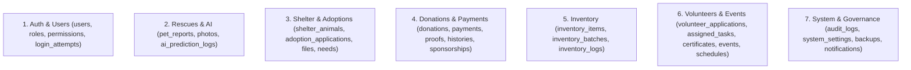

# 📊 Database Schema

The PAWLSE database is structured into 7 core functional domains.

---

## 🏛️ Domain Schema Modules

---

## 🔍 Schema Details by Domain

### 1. Auth & Identity Schema
- **`users`**: `id`, `name`, `email`, `email_verified_at`, `password`, `phone`, `location`, `avatar_path`, `email_verification_otp_hash`, `email_verification_otp_expires_at`, `email_verification_otp_sent_at`, `email_verification_otp_attempts`, `two_factor_secret`, `two_factor_recovery_codes`, `two_factor_confirmed_at`, `remember_token`, `created_at`, `updated_at`, `deleted_at`.
- **`roles`**, **`permissions`**, **`model_has_roles`**, **`model_has_permissions`**, **`role_has_permissions`**: Spatie permission tables.
- **`login_attempts`**: `id`, `email`, `ip_address`, `status` (`successful`, `failed`, `blocked`), `user_agent`, `created_at`.

### 2. Rescue & Stray Reporting Schema
- **`pet_reports`**: `id`, `user_id` (nullable), `assigned_volunteer_id` (nullable), `ai_prediction_log_id` (nullable), `duplicate_of_id` (nullable), `report_type` (`rescue`, `missing`, `found`, `sos`), `animal_type` (`dog`, `cat`, `other`), `breed`, `estimated_age`, `gender`, `distinctive_features`, `location`, `status` (`pending`, `assigned`, `in_progress`, `rescued`, `duplicate`, `resolved`, `cancelled`), `is_duplicate` (boolean), `urgency_level` (`low`, `medium`, `high`, `critical`), `created_at`, `updated_at`, `deleted_at`.
- **`pet_report_photos`**: `id`, `pet_report_id`, `photo_path`, `is_primary`, `created_at`.
- **`ai_prediction_logs`**: `id`, `feature`, `input_data` (JSON), `output_data` (JSON), `confidence` (float), `is_accurate` (boolean nullable), `created_at`.

### 3. Shelter & Adoption Schema
- **`shelter_animals`**: `id`, `name`, `species`, `breed`, `age_category` (`puppy_kitten`, `young`, `adult`, `senior`), `gender`, `size`, `status` (`available`, `pending_adoption`, `adopted`, `medical_hold`, `fostered`), `intake_date`, `rescue_location`, `health_summary`, `vaccination_status`, `is_spayed_neutered`, `story`, `primary_photo_path`, `created_at`, `updated_at`, `deleted_at`.
- **`animal_donation_needs`**: `id`, `shelter_animal_id`, `title`, `description`, `target_amount`, `current_amount`, `priority` (`low`, `medium`, `high`, `critical`), `status` (`active`, `fulfilled`, `cancelled`), `created_at`, `updated_at`.
- **`adoption_applications`**: `id`, `user_id`, `shelter_animal_id`, `application_number`, `status` (`pending`, `under_review`, `home_visit_scheduled`, `approved`, `rejected`, `completed`, `cancelled`), `living_arrangement`, `has_fenced_yard`, `household_members_count`, `other_pets_details`, `home_visit_date`, `rejection_reason`, `admin_notes`, `reviewed_by`, `reviewed_at`, `created_at`, `updated_at`, `deleted_at`.
- **`adoption_application_files`**: `id`, `adoption_application_id`, `document_kind` (`valid_id`, `proof_of_income`, `home_environment_photo`), `file_path`, `file_name`, `created_at`.

### 4. Donations & Payment Schema
- **`donations`**: `id`, `user_id` (nullable), `donation_type` (`cash`, `in_kind`, `sponsorship`), `reference_number` (unique), `donor_name`, `donor_email`, `donor_phone`, `is_anonymous` (boolean), `amount` (decimal nullable), `status` (`pending_verification`, `verified`, `rejected`, `resubmission_requested`), `notes`, `verified_by`, `verified_at`, `created_at`, `updated_at`, `deleted_at`.
- **`payments`**: `id`, `user_id` (nullable), `payment_method` (`gcash`, `maya`, `bank_transfer`), `payment_provider`, `amount`, `currency` (default `PHP`), `status` (`pending`, `completed`, `failed`), `transaction_id`, `created_at`, `updated_at`.
- **`payment_proofs`**: `id`, `payment_id`, `proof_path`, `reference_number`, `notes`, `verified_by`, `verified_at`, `created_at`.
- **`in_kind_donations`**: `id`, `inventory_item_id` (nullable), `category`, `item_description`, `quantity`, `unit`, `estimated_value`, `dropoff_date`, `created_at`.
- **`feeding_sponsorships`**: `id`, `feeding_schedule_id` (nullable), `shelter_animal_id` (nullable), `sponsored_date`, `created_at`.
- **`donation_status_histories`**: `id`, `donation_id`, `from_status`, `to_status`, `reason`, `changed_by`, `created_at`.
- **`donation_audit_logs`**: `id`, `donation_id`, `action`, `changes` (JSON), `user_id`, `created_at`.

### 5. Inventory Schema
- **`inventory_items`**: `id`, `name`, `sku`, `category` (`food`, `medicine`, `cleaning`, `shelter_supplies`), `current_stock`, `minimum_threshold`, `unit` (`kg`, `cans`, `vials`, `boxes`, `pieces`), `unit_price`, `status` (`good`, `low`, `critical`, `depleted`), `created_at`, `updated_at`, `deleted_at`.
- **`inventory_batches`**: `id`, `inventory_item_id`, `batch_number`, `initial_quantity`, `remaining_quantity`, `expiration_date`, `received_date`, `status` (`good`, `low`, `critical`, `expired`, `depleted`), `created_at`, `updated_at`.
- **`inventory_logs`**: `id`, `inventory_item_id`, `user_id`, `type` (`addition`, `usage`, `adjustment`, `loss`, `return`), `quantity_change`, `previous_stock`, `new_stock`, `notes`, `created_at`.

### 6. Volunteers & Events Schema
- **`volunteer_applications`**: `id`, `user_id`, `skills` (JSON), `availability` (JSON), `emergency_contact`, `status` (`pending`, `under_review`, `approved`, `rejected`), `notes`, `reviewed_by`, `reviewed_at`, `created_at`, `updated_at`.
- **`assigned_tasks`**: `id`, `user_id` (volunteer), `pet_report_id` (nullable), `task_type` (`rescue`, `feeding`, `event_support`, `shelter_duty`), `title`, `description`, `status` (`assigned`, `accepted`, `in_progress`, `completed`, `declined`, `cancelled`), `due_date`, `completed_at`, `assigned_by`, `created_at`, `updated_at`.
- **`certificates`**: `id`, `user_id`, `certificate_code` (unique), `title`, `description`, `issued_date`, `issued_by`, `created_at`.
- **`events`**: `id`, `title`, `description`, `location`, `start_time`, `end_time`, `event_type` (`adoption_drive`, `fundraiser`, `community_outreach`), `status` (`scheduled`, `ongoing`, `completed`, `cancelled`), `banner_path`, `created_at`, `updated_at`, `deleted_at`.
- **`feeding_schedules`**: `id`, `event_id` (nullable), `coordinator_id` (nullable), `route_name`, `start_point`, `feeding_time`, `days_of_week` (JSON), `assigned_volunteers_count`, `target_animals_count`, `created_at`, `updated_at`.

### 7. System & Governance Schema
- **`audit_logs`**: `id`, `user_id` (nullable), `action` (`create`, `update`, `delete`, `restore`, `force_delete`, `login`), `model_type`, `model_id`, `old_values` (JSON), `new_values` (JSON), `ip_address`, `user_agent`, `created_at`.
- **`system_settings`**: `id`, `key` (unique string), `value` (JSON), `created_at`, `updated_at`.
- **`backups`**: `id`, `filename`, `disk`, `size_bytes`, `type` (`auto`, `manual`), `status` (`completed`, `failed`), `created_at`, `updated_at`.
- **`notifications`**: Laravel standard database notification table (`id`, `type`, `notifiable_type`, `notifiable_id`, `data`, `read_at`, `created_at`).

---

## 🔗 Related Documentation
- [[Database Overview]]
- [[Tables]]
- [[Relationships]]
- [[Migrations]]
