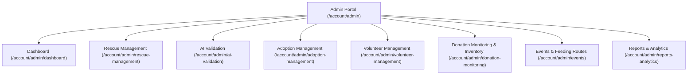

# 🛠️ Admin Features

The **Admin Module** serves as the primary operational command center for **Iligan Stray Feeders** shelter staff.

---

## 🌟 Capabilities & Pages

---

## 🔍 Feature Breakdown

### 1. Operational Overview Dashboard
- **Page**: `resources/js/pages/admin/dashboard.tsx`
- **Controller**: `Admin\DashboardController::index`
- **Metrics**: Real-time counters for pending rescues, active adoption applications, low inventory alerts, today's feeding schedules, and recent activity logs.

### 2. Rescue & SOS Management
- **Page**: `resources/js/pages/admin/rescue-management.tsx`
- **Controller**: `Admin\RescueManagementController`
- **Capabilities**:
  - Filter reports by status (`pending`, `assigned`, `in_progress`, `rescued`, `duplicate`).
  - Assign field rescues directly to active volunteers.
  - Review automated duplicate flags (Haversine 500m / 24h match) and merge or unlink cases.

### 3. AI Classification Validation
- **Page**: `resources/js/pages/admin/ai-validation.tsx`
- **Controller**: `Admin\AiValidationController`
- **Capabilities**:
  - Inspect AI breed, age, and gender predictions against user-uploaded images.
  - Approve AI findings into verified animal records or reject/override inaccuracies to train future telemetry.

### 4. Adoption Approval & Pet Management
- **Page**: `resources/js/pages/admin/adoption-management.tsx`
- **Controllers**: `Admin\AdoptionManagementController`, `Admin\AdoptablePetController`
- **Capabilities**:
  - Review application dossiers, attached valid IDs, and proof of income.
  - Schedule home visits with automated email/dashboard notifications.
  - Manage shelter pet profiles (`ShelterAnimal`) and define urgent medical/food donation targets (`AnimalDonationNeed`).

### 5. Volunteer Coordination & Tasking
- **Page**: `resources/js/pages/admin/volunteer-management.tsx`
- **Controller**: `Admin\VolunteerManagementController`
- **Capabilities**:
  - Review and approve pending volunteer applicants.
  - Assign specific rescue or shelter duty tasks.
  - Issue official digital certificates of appreciation with unique verification numbers.

### 6. Donation Monitoring & Shelter Inventory
- **Page**: `resources/js/pages/admin/donation-monitoring.tsx`
- **Controller**: `Admin\DonationMonitoringController`
- **Capabilities**:
  - Inspect GCash, Maya, and Bank transfer payment proof screenshots and verify or reject receipts.
  - Verify in-kind item donations and auto-increment inventory counts.
  - Manage inventory item batches, expiration dates, stock status (`good`, `low`, `critical`, `depleted`), and stock adjustment logs.

### 7. Event & Feeding Schedule Management
- **Page**: `resources/js/pages/admin/events.tsx`
- **Controller**: `Admin\EventManagementController`
- **Capabilities**:
  - Create and schedule community adoption drives, fundraisers, and outreach campaigns.
  - Define recurring feeding routes with designated coordinators, start points, and route checkpoints.

### 8. Operational Reports & Analytics
- **Page**: `resources/js/pages/admin/reports-analytics.tsx`
- **Controller**: `Admin\ReportsAnalyticsController`
- **Capabilities**:
  - Interactive charts for monthly rescue trends, adoption success rates, and donation volumes.
  - One-click CSV export of operational data for stakeholder meetings.

---

## 🔗 Related Documentation
- [[Dashboard]]
- [[Volunteer Features]]
- [[Super Admin Features]]
- [[AdoptionStatusTransition|Services]]
- [[DonationStatusTransition|Services]]
