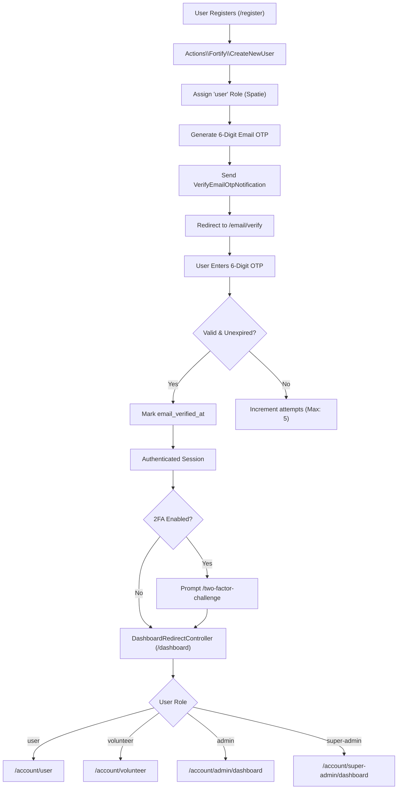

# 🔐 Authentication

PAWLSE implements a multi-layer authentication architecture using **Laravel Fortify**, custom **6-digit Email Verification OTP**, and **Two-Factor Authentication (2FA)**.

---

## 🏗️ Authentication Lifecycle

---

## 🔍 Authentication Subsystems

### 1. Registration & Role Provisioning (`CreateNewUser.php`)
- New users register with `name`, `email`, and `password`.
- Passwords must meet strict requirements (`min:8`, mixed case, numbers, symbols).
- The user is automatically assigned the `user` role via Spatie (`$user->assignRole(Role::User->value)`).

### 2. 6-Digit Email Verification OTP (`EmailVerificationOtpController.php`)
- Traditional email link verification is replaced with a 6-digit numeric one-time password.
- OTP characteristics:
  - Stored as a hashed value in `email_verification_otp_hash`.
  - Valid for 10 minutes (`config('auth.email_otp.expire', 10)`).
  - Rate limited to 5 failed attempts before cooldown (`recordEmailVerificationOtpAttempt()`).
  - Resend cooldown enforced at 60 seconds (`emailVerificationOtpResendAvailableAt()`).

### 3. Two-Factor Authentication (2FA)
- Powered by Laravel Fortify with QR code pairing for Google Authenticator / Authy.
- Encrypted recovery codes generated for emergency access.

### 4. Security Audit & Login Attempts (`login_attempts` table)
- Successful and failed login attempts are recorded via `LogSuccessfulLogin` and `LogFailedLogin` event listeners, capturing IP address, email, user agent, and timestamp.

---

## 🔗 Related Documentation
- [[Authorization & RBAC]]
- [[Dashboard]]
- [[Controllers]]
- [[Email & Notifications]]
