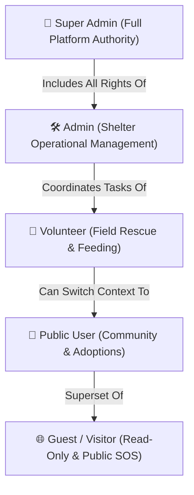

# 🛡️ Authorization & RBAC

PAWLSE implements a strict **Role-Based Access Control (RBAC)** model powered by `spatie/laravel-permission` and the PHP 8 enum `App\Enums\Role`.

---

## 👥 Role Hierarchy & Capabilities



---

## 📊 RBAC Permissions Matrix

| Feature / Action | Guest | User | Volunteer | Admin | Super Admin |
|---|:---:|:---:|:---:|:---:|:---:|
| Browse Public Home, About, Adopt, Events | ✅ | ✅ | ✅ | ✅ | ✅ |
| Submit Rescue & SOS Reports | ✅ | ✅ | ✅ | ✅ | ✅ |
| Make Cash / In-Kind / Sponsor Donations | ✅ | ✅ | ✅ | ✅ | ✅ |
| Submit Adoption Application | ❌ | ✅ | ✅ | ✅ | ✅ |
| Apply as Shelter Volunteer | ❌ | ✅ | ⚠️ (Already) | ❌ | ❌ |
| Switch Role (Volunteer ⇄ User) | ❌ | ❌ | ✅ | ❌ | ❌ |
| View Assigned Field Rescue Tasks | ❌ | ❌ | ✅ | ✅ | ✅ |
| Update Rescue Incident Status | ❌ | ❌ | ✅ | ✅ | ✅ |
| View Digital Volunteer Certificates | ❌ | ❌ | ✅ | ❌ | ❌ |
| Approve / Reject Adoption Applications | ❌ | ❌ | ❌ | ✅ | ✅ |
| Manage Adoptable Pets & Urgent Needs | ❌ | ❌ | ❌ | ✅ | ✅ |
| Verify Cash & In-Kind Donations | ❌ | ❌ | ❌ | ✅ | ✅ |
| Manage Medical & Food Inventory | ❌ | ❌ | ❌ | ✅ | ✅ |
| Assign Tasks to Volunteers | ❌ | ❌ | ❌ | ✅ | ✅ |
| Create Events & Feeding Schedules | ❌ | ❌ | ❌ | ✅ | ✅ |
| Validate AI Animal Predictions | ❌ | ❌ | ❌ | ✅ | ✅ |
| Export Analytical Reports | ❌ | ❌ | ❌ | ✅ | ✅ |
| User & Role Management (CRUD) | ❌ | ❌ | ❌ | ❌ | ✅ |
| System-Wide Audit Logs | ❌ | ❌ | ❌ | ❌ | ✅ |
| Archive Management & Force Delete | ❌ | ❌ | ❌ | ❌ | ✅ |
| Database Backup & Restore | ❌ | ❌ | ❌ | ❌ | ✅ |
| AI Model Threshold Settings | ❌ | ❌ | ❌ | ❌ | ✅ |
| System Settings & Maintenance Mode | ❌ | ❌ | ❌ | ❌ | ✅ |

---

## 🔒 Route Protection Architecture

Route groups in `routes/web.php` use Spatie's `RoleMiddleware`:
```php
$userDashboardMiddleware = ['auth', 'verified', RoleMiddleware::using(Role::User)];
$volunteerDashboardMiddleware = ['auth', 'verified', RoleMiddleware::using(Role::Volunteer)];
$adminDashboardMiddleware = ['auth', 'verified', RoleMiddleware::using([Role::Admin, Role::SuperAdmin])];
$superAdminDashboardMiddleware = ['auth', 'verified', RoleMiddleware::using(Role::SuperAdmin)];
```

---

## 🔗 Related Documentation
- [[Authentication]]
- [[Dashboard]]
- [[User Features]]
- [[Volunteer Features]]
- [[Admin Features]]
- [[Super Admin Features]]
