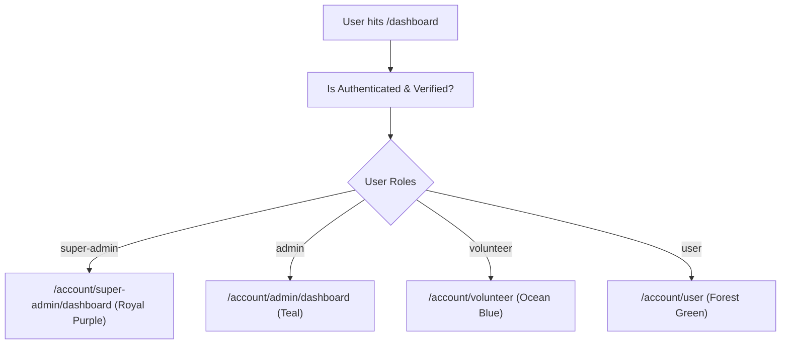

# 📊 Dashboard Overview

The **PAWLSE Dashboard System** provides tailored operational dashboards dynamically loaded based on the user's authenticated role.

---

## 🧭 Dashboard Redirection Logic

When an authenticated user visits `/dashboard`, `DashboardRedirectController` determines their active role and redirects to the designated portal:

---

## 🎨 Dashboard Chrome & Dynamic Theming

Every dashboard is wrapped in `DashboardLayout` and dynamically applies the `data-dashboard-theme` attribute to the root DOM:

| Role | Route Prefix | Accent Color | Hex Code | Primary Purpose |
|---|---|---|---|---|
| **User** | `/account/user/*` | Forest Green | `#16a34a` | Track adoptions, personal donations, bookmarks, submitted rescues |
| **Volunteer** | `/account/volunteer/*` | Ocean Blue | `#00b4d8` | Accept field rescue tasks, update mission statuses, view certificates |
| **Admin** | `/account/admin/*` | Deep Teal | `#0d9488` | Operational dispatch, adoption approvals, donation verification, inventory |
| **Super Admin** | `/account/super-admin/*`| Royal Purple | `#7c3aed` | System governance, user accounts, audit trails, backups, AI thresholds |

---

## 🔔 Integrated Real-Time Notifications

The dashboard header includes an interactive notification dropdown connected to Laravel's database notifications:
- Shows unread counter badge.
- Instant mark-as-read and clear-all capabilities.
- Direct deep links to relevant cases (e.g., clicking an adoption update navigates to `/account/user/adoption-applications`).

---

## 🔗 Related Documentation
- [[User Features]]
- [[Volunteer Features]]
- [[Admin Features]]
- [[Super Admin Features]]
- [[Layouts]]
- [[Colors & Themes]]
