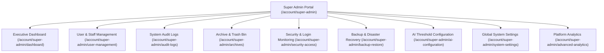

# 👑 Super Admin Features

The **Super Admin Module** represents the highest authority in the PAWLSE architecture, providing system governance, security monitoring, disaster recovery, and platform configuration.

---

## 🌟 Capabilities & Pages

---

## 🔍 Feature Breakdown

### 1. User & Staff Management
- **Page**: `resources/js/pages/super-admin/user-management.tsx`
- **Controller**: `SuperAdmin\UserManagementController`
- **Capabilities**:
  - Provision and edit administrator, volunteer, and user accounts.
  - Assign and revoke Spatie RBAC roles (`user`, `volunteer`, `admin`, `super-admin`).
  - Force password resets, account deactivations, and soft-delete restorations.

### 2. System-Wide Audit Logs
- **Page**: `resources/js/pages/super-admin/audit-logs.tsx`
- **Controller**: `SuperAdmin\AuditLogController`
- **Capabilities**:
  - Filter immutable log entries by action (`create`, `update`, `delete`, `restore`, `force_delete`, `login`), model type, user, date range, or IP address.
  - Inspect JSON diffs comparing old attribute states with new values.

### 3. Archive Management (Soft Delete Bin)
- **Page**: `resources/js/pages/super-admin/archives.tsx`
- **Controller**: `SuperAdmin\ArchiveController`
- **Capabilities**:
  - Centralized trash bin managing soft-deleted records across 7 core entities: Users, Shelter Animals, Pet Reports, Adoption Applications, Donations, Events, and Inventory Items.
  - Single-click **Restore** to un-archive records.
  - **Force Delete** (Hard permanent deletion) restricted exclusively to Super Admins.

### 4. Security & Access Monitoring
- **Page**: `resources/js/pages/super-admin/security-access.tsx`
- **Controller**: `SuperAdmin\SecurityController`
- **Capabilities**:
  - Inspect real-time authentication logs (`login_attempts` table).
  - Detect brute-force patterns and suspicious IP addresses.

### 5. Backup & Disaster Recovery
- **Page**: `resources/js/pages/super-admin/backup-restore.tsx`
- **Controller**: `SuperAdmin\BackupController`
- **Capabilities**:
  - Trigger manual database snapshots or configure automated cron backups (`AutoBackupCommand`).
  - Single-click database restore point deployment.
  - Download `.sql` / `.gz` snapshots to external secure storage.

### 6. AI Model Configuration Panel
- **Page**: `resources/js/pages/super-admin/ai-configuration.tsx`
- **Controller**: `SuperAdmin\AiConfigController`
- **Capabilities**:
  - Configure AI confidence threshold (e.g. `0.70`).
  - Toggle feature switches: Master AI toggle (`ai_enabled`), AI reporting toggle (`ai_reporting_enabled`), Pet identification toggle (`ai_identifying_enabled`), and Auto-validation toggle (`ai_auto_validation`).
  - Review AI classification performance telemetry and accuracy rates.

### 7. Global System Settings
- **Page**: `resources/js/pages/super-admin/system-settings.tsx`
- **Controller**: `SuperAdmin\SystemSettingsController`
- **Capabilities**:
  - Update shelter operational hours, official hotline numbers, emergency dispatch contacts, social media URLs, and toggle maintenance mode.

---

## 🔗 Related Documentation
- [[Dashboard]]
- [[Admin Features]]
- [[Authorization & RBAC]]
- [[Database Overview]]
