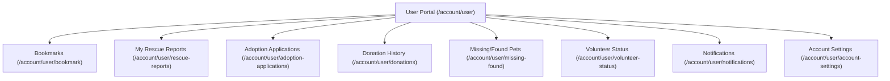

# 👤 User Features

The **Public User Module** empowers community members and adopters to engage with shelter operations.

---

## 🌟 Capabilities & Pages

---

## 🔍 Feature Breakdown

### 1. Adoption Application Tracking
- **Page**: `resources/js/pages/user/adoption-applications.tsx`
- **Controller**: `Adoptions\AdoptionApplicationController::index`
- **Capabilities**:
  - View real-time status: `pending`, `under_review`, `home_visit_scheduled`, `approved`, `rejected`, `completed`.
  - View scheduled home visit dates and reviewer notes.
  - Review submitted documentation (valid ID, proof of income, home photos).

### 2. Personal Rescue & SOS Submissions
- **Page**: `resources/js/pages/user/rescue-reports.tsx`
- **Controller**: `PetReportController::userReports`
- **Capabilities**:
  - Track rescue cases submitted by the user.
  - View assigned volunteer details and live status updates (`assigned`, `in_progress`, `rescued`).
  - Access uploaded photos and AI scan diagnostics.

### 3. Donation Receipts & History
- **Page**: `resources/js/pages/user/donations.tsx`
- **Controller**: `Donations\DonationController::index`
- **Capabilities**:
  - View ledger of cash donations, in-kind pledges, and sponsorships.
  - View transaction verification status and download official digital receipts.

### 4. Missing & Found Pet Reports
- **Page**: `resources/js/pages/user/missing-found.tsx`
- **Controller**: `PetReportController::userMissingFoundReports`
- **Capabilities**:
  - Manage lost pet listings, update last seen locations, or mark pets as reunited/resolved.

### 5. Volunteer Application Status & Role Switching
- **Page**: `resources/js/pages/user/volunteer-status.tsx`
- **Controller**: `VolunteerDashboardController::userStatus`
- **Capabilities**:
  - Track shelter volunteer application review.
  - If approved, access one-click role switching to launch the Volunteer Dashboard (`/volunteer/switch`).

---

## 🔗 Related Documentation
- [[Dashboard]]
- [[Volunteer Features]]
- [[Adoption Management|Admin Features]]
- [[Authentication]]
