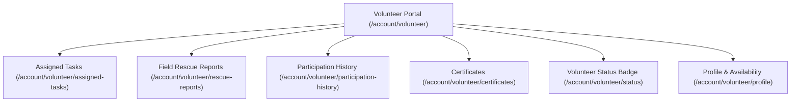

# 🙋 Volunteer Features

The **Volunteer Module** is tailored for approved field volunteers to accept rescue missions, participate in feeding drives, and track community milestones.

---

## 🌟 Capabilities & Pages

---

## 🔍 Feature Breakdown

### 1. Assigned Task Dispatch
- **Page**: `resources/js/pages/volunteer/assigned-tasks.tsx`
- **Controller**: `VolunteerDashboardController::assignedTasks`
- **Capabilities**:
  - Receive automated notifications upon task assignment by shelter admins.
  - Review mission details: location coordinates, animal condition, urgency level, reporter contact.
  - Accept or decline assigned missions.
  - Update progress status: `accepted` ➔ `in_progress` ➔ `completed`.

### 2. Field Rescue Incident Updates
- **Page**: `resources/js/pages/volunteer/rescue-reports.tsx`
- **Controller**: `PetReportController::volunteerReports` / `updateStatus`
- **Capabilities**:
  - Direct status transitions from the field (`in_progress`, `rescued`, `cancelled`).
  - Attach post-rescue photos and medical triage notes.

### 3. Participation History & Mileage
- **Page**: `resources/js/pages/volunteer/participation-history.tsx`
- **Controller**: `VolunteerDashboardController::participationHistory`
- **Capabilities**:
  - Comprehensive timeline of completed rescue missions, scheduled feeding routes, and adoption drive assistances.

### 4. Digital Certificates of Recognition
- **Page**: `resources/js/pages/volunteer/certificates.tsx`
- **Controller**: `VolunteerDashboardController::certificates`
- **Capabilities**:
  - View verified certificates issued by shelter administrators for volunteer hours and exemplary rescue services.
  - Download digital certificates with unique verification codes.

### 5. Profile & Availability Management
- **Page**: `resources/js/pages/volunteer/profile-information.tsx`
- **Controller**: `VolunteerDashboardController::updateProfile`
- **Capabilities**:
  - Set active availability (Weekdays, Weekends, Emergency On-Call).
  - Declare skills (Pet Handling, First Aid, Driving/Transport, Photography).

---

## 🔗 Related Documentation
- [[Dashboard]]
- [[User Features]]
- [[Admin Features]]
- [[Rescue Management|Admin Features]]
