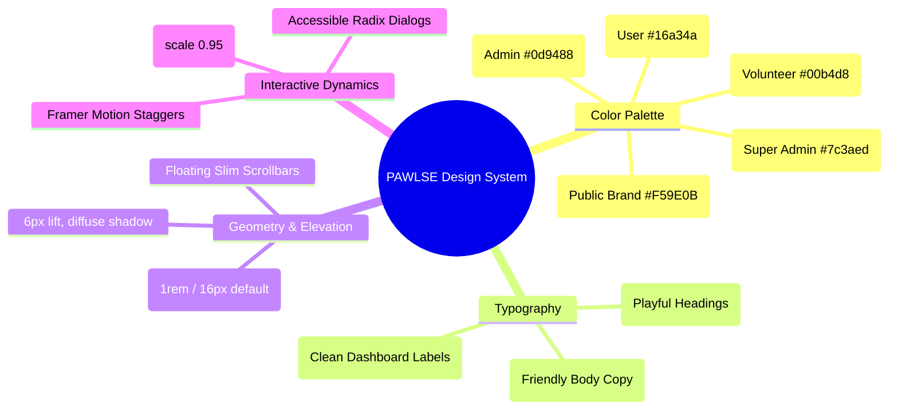

# 🎨 Design System

The **PAWLSE Design System** merges an inviting, animal-welfare-friendly aesthetic with a clean, high-density dashboard UI built on **Tailwind CSS v4** and **Radix UI**.

---

## 🏛️ Design Foundations

---

## 📏 Core Design Tokens

### 1. Spacing & Corner Radii
- `--radius`: `1rem` (`16px`)
- `--radius-lg`: `1rem`
- `--radius-md`: `0.875rem` (`14px`)
- `--radius-sm`: `0.75rem` (`12px`)
- `--radius-xl`: `1.25rem` (`20px`)

### 2. Micro-Interactions & Hover Dynamics
Defined in `resources/css/app.css`:
- **Primary Buttons (`.bg-paw-orange`)**: Smooth scaling (`scale(1.03)`) with a warm glow shadow (`0 8px 24px rgba(245, 158, 11, 0.4)`).
- **Cards (`.group:has(> .card-hover)`)**: Subtle vertical lift (`translateY(-6px)`) with elevation shadow (`0 20px 40px rgba(0, 0, 0, 0.2)`).
- **Nav Links (`.nav-link`)**: Underline expanding smoothly from left to right on hover.
- **Scrollbar**: Custom floating pill thumb styled with warm gradients and transparent tracks.

### 3. Dark & Light Mode
- Powered by `next-themes` and Tailwind CSS v4 `@custom-variant dark (&:is(.dark *))`.
- Automatically adjusts CSS variables (`--background`, `--foreground`, `--card`, `--border`, `--muted`).

---

## 🔗 Related Documentation
- [[Colors & Themes]]
- [[Typography]]
- [[Components|UI Components]]
- [[Responsive Design]]
