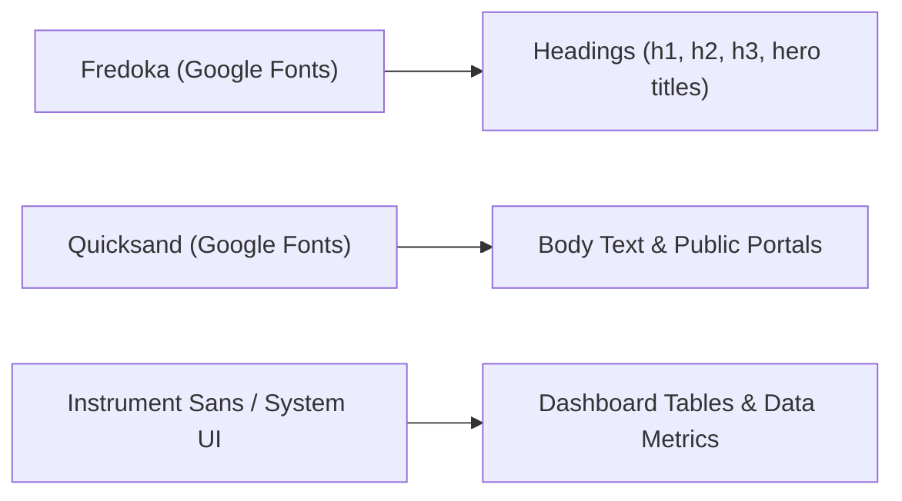

# 🔤 Typography

PAWLSE combines warm, rounded display typefaces for community engagement with crisp, legible sans-serif fonts for data-heavy dashboard panels.

---

## 🖋️ Font Families



---

## 📐 Font Hierarchy Specifications

### 1. Headings (`Fredoka`)
- **H1 (Hero / Page Title)**: `text-4xl font-bold leading-tight` (`36px` / `2.25rem`)
- **H2 (Section Header)**: `text-3xl font-bold leading-tight` (`30px` / `1.875rem`)
- **H3 (Card Title / Subheader)**: `text-2xl font-bold leading-tight` (`24px` / `1.5rem`)
- **H4 - H6**: `text-xl` to `text-base` `font-semibold`

### 2. Body Text (`Quicksand`)
- **Body Regular**: `text-base font-normal` (`16px` / `1rem`)
- **Body Small / Captions**: `text-sm font-medium` (`14px` / `0.875rem`)
- **Muted Labels / Timestamps**: `text-xs text-muted-foreground` (`12px` / `0.75rem`)

### 3. Font Loading (`resources/css/app.css`)
```css
@import url('https://fonts.googleapis.com/css2?family=Fredoka:wght@300..700&family=Quicksand:wght@300..700&display=swap');
```

---

## 🔗 Related Documentation
- [[Design System]]
- [[Colors & Themes]]
- [[Components|UI Components]]
