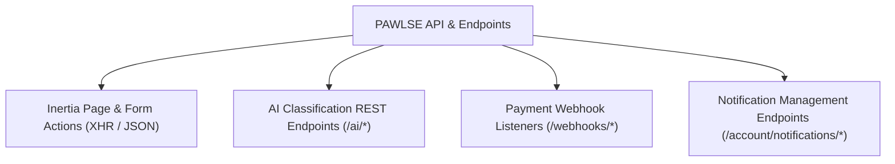

# 🔌 API Overview

PAWLSE operates primarily via **Inertia.js server-driven endpoints** while providing specialized JSON REST endpoints for AI image inference and future mobile/external clients.

---

## 📡 Endpoint Categorization



---

## 🔍 Internal API Endpoints

### 1. AI Inference Services
- **`POST /ai/predict`**
  - **Controller**: `PetController::predict`
  - **Payload**: Multipart form data with `image` file (`max: 10240 KB`).
  - **Response**:
    ```json
    {
      "species": "dog",
      "breed": "Aspin / Native",
      "age_category": "adult",
      "gender": "male",
      "confidence": 0.89,
      "prediction_log_id": 42
    }
    ```
- **`POST /ai/generate-names`**
  - **Controller**: `PetController::generateNames`
  - **Payload**: `{ "species": "dog", "gender": "female" }`
  - **Response**:
    ```json
    {
      "names": ["Luna", "Bella", "Daisy", "Ginger", "Nala"]
    }
    ```

### 2. User Notification Endpoints
- **`PATCH /account/notifications/{notification}/read`**: Mark specific notification as read.
- **`PATCH /account/notifications/read-all`**: Bulk mark all unread notifications as read.
- **`DELETE /account/notifications/{notification}`**: Dismiss/delete notification.
- **`DELETE /account/notifications/clear-all`**: Clear all notification logs for user.

---

## 🔗 Related Documentation
- [[External APIs]]
- [[Email & Notifications]]
- [[Routes]]
- [[Controllers]]
