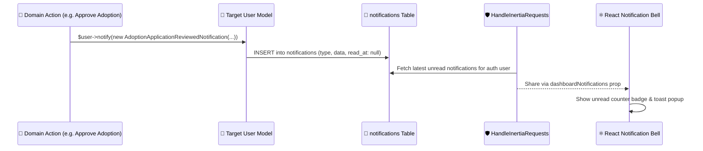

# 📬 Email & Notifications

PAWLSE provides an automated notification pipeline supporting both **in-app database notifications** and **transactional SMTP emails**.

---

## 🔔 Notification Catalog (`app/Notifications/`)

| Notification Class | Delivery Channel | Trigger Event & Recipient |
|---|---|---|
| **`VerifyEmailOtpNotification`** | Mail | Sent on registration or resend to verify email with 6-digit OTP |
| **`AdoptionApplicationSubmittedNotification`** | Database, Mail | Sent to Admins when a new adoption request is lodged |
| **`AdoptionApplicationReviewedNotification`** | Database, Mail | Sent to User when adoption application status updates |
| **`AdoptionApplicationStatusUpdatedNotification`**| Database, Mail | Sent to User on home visit scheduled, approval, or rejection |
| **`RescueReportSubmittedNotification`** | Database, Mail | Sent to Admins & available Volunteers on new rescue report |
| **`RescueTaskAssignedNotification`** | Database, Mail | Sent to Volunteer when assigned a field rescue mission |
| **`RescueStatusUpdatedNotification`** | Database | Sent to reporting User when animal status changes to `rescued` |
| **`DonationReceivedNotification`** | Database, Mail | Sent to Donor confirming donation submission and reference number |
| **`DonationProofSubmittedNotification`** | Database | Sent to Admins when payment receipt is uploaded |
| **`DonationVerifiedNotification`** | Database, Mail | Sent to Donor with verified status and receipt |
| **`DonationRejectedNotification`** | Database, Mail | Sent to Donor if receipt is invalid or unreadable |
| **`DonationResubmissionRequestedNotification`**| Database, Mail | Sent to Donor requesting clear receipt re-upload |
| **`VolunteerApplicationSubmittedNotification`** | Database | Sent to Admins upon new volunteer registration |
| **`VolunteerApplicationReviewedNotification`** | Database, Mail | Sent to Applicant upon volunteer approval/rejection |
| **`VolunteerTaskAssignedNotification`** | Database | Sent to Volunteer upon new task assignment |
| **`VolunteerCertificateIssuedNotification`** | Database, Mail | Sent to Volunteer when digital certificate is awarded |

---

## ⚙️ In-App Database Notifications Pipeline

---

## 🔗 Related Documentation
- [[Authentication]]
- [[User Features]]
- [[Volunteer Features]]
- [[Admin Features]]
- [[API Overview]]
