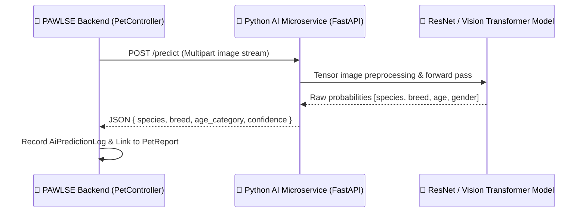

# 🌐 External APIs & Integrations

This document details the external microservices, payment gateways, and third-party APIs integrated with PAWLSE.

---

## 🤖 1. AI Vision & Identification Microservice

### Configuration (`config/services.php`)
- `services.ai.url`: Endpoint URL of the Python AI service (e.g. `http://127.0.0.1:8000`).
- **Timeout**: 120 seconds configured in `Http::timeout(120)`.

---

## 💳 2. Payment Providers & Gateways

PAWLSE supports both direct manual receipt verification and prepared automated webhook integrations.

### Integrated Providers (`App\Enums\PaymentProvider`):
1. **GCash** (Direct QR & Reference Number)
2. **Maya** (Direct QR & Reference Number)
3. **Bank Transfer** (BDO / BPI / UnionBank manual deposit receipts)
4. **Automated Gateway (PayMongo / Xendit)**:
   - `PaymentWebhookController` is structured to consume incoming charge/event webhooks.
   - Idempotency records prevent double-crediting via the `idempotency_records` table.

---

## 🗺️ 3. Map & Geocoding Services

- Rescue location coordinates are parsed using regex or browser Geolocation API (`navigator.geolocation.getCurrentPosition`).
- Real-time duplicate calculation uses internal **Haversine Distance calculations** without incurring external third-party geocoding API costs.

---

## 🔗 Related Documentation
- [[API Overview]]
- [[Email & Notifications]]
- [[Donation Monitoring|Admin Features]]
- [[AiValidationController|Controllers]]
