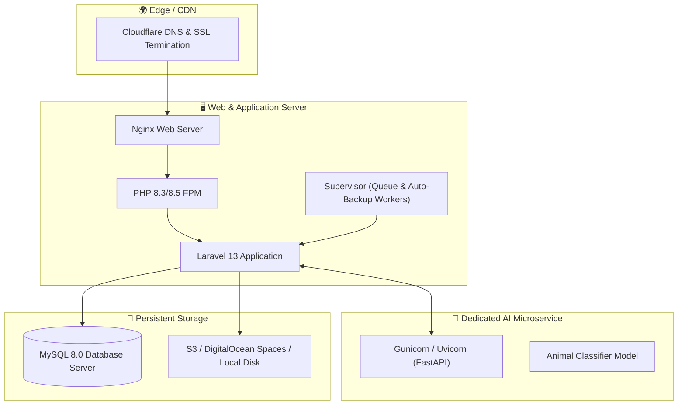

# 🚀 Deployment Guide

This guide outlines requirements and deployment procedures for hosting **PAWLSE** in staging and production environments.

---

## 🏗️ Production Architecture



---

## 📋 Production Deployment Checklist

### 1. Environment & Secrets Configuration
- Set `APP_ENV=production` and `APP_DEBUG=false` in `.env`.
- Ensure strong application key: `php artisan key:generate`.
- Set MySQL credentials and SMTP mail settings.

### 2. Dependency Installation & Asset Build
```bash
# Install optimized PHP dependencies
composer install --no-dev --optimize-autoloader

# Install Node dependencies and compile production frontend
npm ci
npm run build
```

### 3. Optimization Commands
```bash
# Cache configuration, routes, and views
php artisan config:cache
php artisan route:cache
php artisan view:cache

# Run database migrations
php artisan migrate --force

# Symlink public storage
php artisan storage:link
```

### 4. Background Processes (Supervisor)
Configure Supervisor to keep the queue worker and scheduled auto-backup active:
```ini
[program:pawlse-worker]
process_name=%(program_name)s_%(process_num)02d
command=php /var/www/pawlse/artisan queue:work --sleep=3 --tries=3 --max-time=3600
autostart=true
autorestart=true
user=www-data
numprocs=2
redirect_stderr=true
```

---

## 🔗 Related Documentation
- [[Development Setup]]
- [[Development Workflow]]
- [[Technology Stack]]
