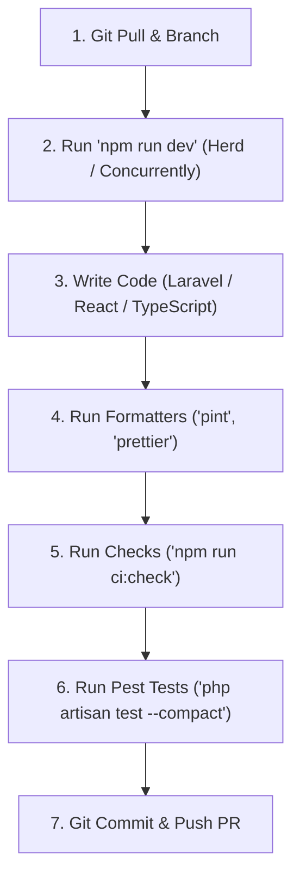

# 💻 Development Workflow

This document outlines daily developer workflows, standards, and quality commands for the PAWLSE project.

---

## 🔄 Daily Development Cycle



---

## 🛠️ Essential Commands Directory

### 1. Starting Servers
```bash
# Start Vite with HMR (Laravel Herd serves the backend)
npm run dev

# Or run full concurrent stack (PHP server + Queue worker + Vite):
composer run dev
```

### 2. Code Quality & Formatting
```bash
# Format PHP using Laravel Pint (agent format)
vendor/bin/pint --format agent

# Format Frontend files using Prettier
npm run format

# Run ESLint across TypeScript / React
npm run lint

# Check TypeScript static types
npm run types:check
```

### 3. Full CI Verification Suite
Run the complete automated check suite before pushing code:
```bash
npm run ci:check
```
*(Executes Pint check, Prettier check, TypeScript type-check, and Pest tests)*

---

## 🔗 Related Documentation
- [[Git Workflow]]
- [[Testing]]
- [[Deployment]]
- [[Development Setup]]
