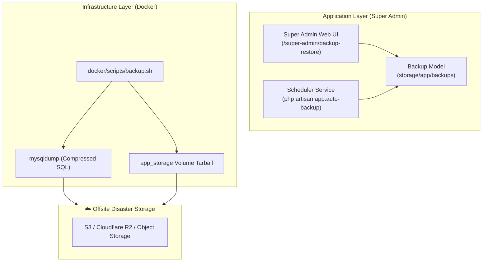

# 🛡️ Disaster Recovery (DR) & Backup Strategy

This document outlines the Disaster Recovery architecture, policies, automated backup systems, and recovery playbooks for **PAWLSE**.

---

## 🎯 Disaster Recovery Objectives

| Metric | Target | Description |
| :--- | :--- | :--- |
| **RPO** *(Recovery Point Objective)* | $\le$ 24 Hours (Daily) | Maximum acceptable data loss period in the event of hardware or data corruption. |
| **RTO** *(Recovery Time Objective)* | $\le$ 15 Minutes | Target duration to bring services fully back online from cold storage. |
| **Backup Redundancy** | 3-2-1 Strategy | 3 copies of data, across 2 different media formats, with 1 offsite cloud replica. |

---

## 🏗️ Backup Architecture & Subsystems



---

## ⚙️ 1. Automated Application-Level Backups

PAWLSE includes an automated database backup runner (`app:auto-backup`) managed via the `SystemSetting` table.

### Configuration
By default, newly seeded environments enable daily automated backups with a 30-day retention policy:
- **`auto_enabled`**: `true`
- **`interval`**: `daily` (or `weekly` / `monthly`)
- **`retention_days`**: `30`

### Execution Flow
1. Laravel Scheduler triggers `app:auto-backup` daily inside the `scheduler` Docker container.
2. The command executes `Backup::createBackup()`, producing a timestamped `.sql` dump under `storage/app/backups/`.
3. It deletes backups older than `retention_days` automatically.
4. Backups are viewable, downloadable, and restorable directly from the **Super Admin Web Dashboard** (`/super-admin/backup-restore`).

---

## 🤖 2. Automated Infrastructure Scripts

Two scripts are provided under `docker/scripts/`:

### A. Creating an Immediate Backup
```bash
./docker/scripts/backup.sh
```
This generates:
- `backups/pawlse_db_YYYYMMDD_HHMMSS.sql.gz` (Full MySQL schema and data dump)
- `backups/pawlse_storage_YYYYMMDD_HHMMSS.tar.gz` (User avatars, pet photos, certificates, report photos)

### B. Restoring from a Backup
```bash
./docker/scripts/restore.sh ./backups/pawlse_db_latest.sql.gz ./backups/pawlse_storage_latest.tar.gz
```

---

## 🚨 Disaster Recovery Playbook

### Scenario 1: Accidental Data Corruption or Mistaken Deletion
1. Log in to the Super Admin Dashboard: `/super-admin/backup-restore`.
2. Locate the most recent healthy backup from the table.
3. Click **Restore**.

### Scenario 2: Complete Host Server Destruction (Cold Rebuild)
1. Provision a new server with Docker & Docker Compose installed.
2. Clone the repository:
   ```bash
   git clone <repository-url> /var/www/pawlse
   cd /var/www/pawlse
   ```
3. Populate production `.env` with production secrets (`APP_KEY`, database credentials, etc.).
4. Start database and storage dependencies:
   ```bash
   docker compose -f compose.production.yaml up -d mysql redis
   ```
5. Restore database and storage archives:
   ```bash
   ./docker/scripts/restore.sh /path/to/pawlse_db_latest.sql.gz /path/to/pawlse_storage_latest.tar.gz
   ```
6. Launch the entire application stack:
   ```bash
   docker compose -f compose.production.yaml up -d
   ```

---

## 🔗 Related Documentation
- [[Container Architecture]]
- [[Docker Development]]
- [[Database Overview]]
- [[Deployment]]
