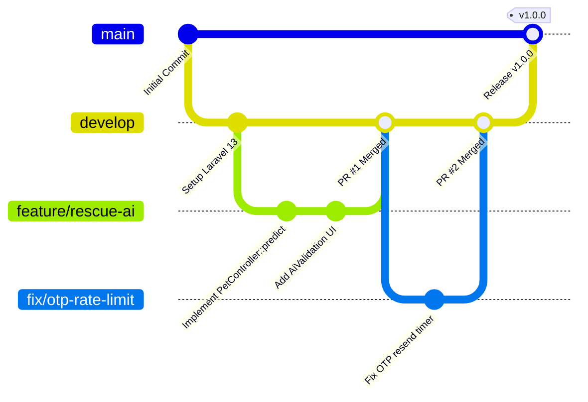

# 🌿 Git Workflow

PAWLSE follows a clean **Feature Branch Git Workflow** to ensure stability on the `main` branch.

---

## 🌳 Branching Strategy

---

## 🏷️ Branch Naming Conventions

- **Features**: `feature/<feature-name>` (e.g. `feature/donation-checkout`, `feature/live-map`)
- **Bug Fixes**: `fix/<bug-description>` (e.g. `fix/avatar-upload-path`, `fix/haversine-coords`)
- **Documentation**: `docs/<topic>` (e.g. `docs/obsidian-vault-setup`)
- **Refactoring**: `refactor/<module>` (e.g. `refactor/donation-transition`)

---

## 📝 Commit Message Standard

Follow the **Conventional Commits** standard:
- `feat: add AI confidence threshold slider in super-admin`
- `fix: resolve duplicate calculation when coordinates are missing`
- `docs: add comprehensive database relationship documentation`
- `refactor: extract adoption status state machine to domain class`
- `test: add feature test for cash donation verification`

---

## 🔗 Related Documentation
- [[Development Workflow]]
- [[Testing]]
- [[Deployment]]
